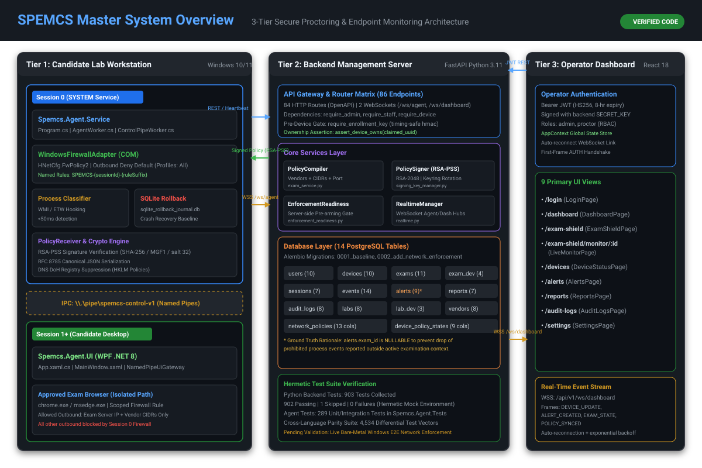
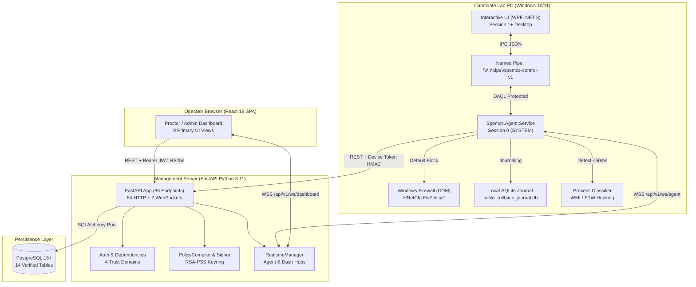

# 00. START HERE: Zero-Knowledge Introduction to SPEMCS

Welcome to the technical master operating manual and illustrated textbook for **SPEMCS** (**Secure Proctoring & Endpoint Monitoring Control System**).

Whether you are a junior software engineer, backend developer, frontend developer, DevOps engineer, security auditor, academic project evaluator, or future maintainer, this textbook is designed to take you from **absolute zero knowledge to a complete, deep architectural understanding** of the entire codebase without needing to guess or search blindly.

---

## What Am I Looking At?



SPEMCS is an enterprise examination integrity and endpoint security platform specifically engineered for university and institutional computer labs. It is structured as a **3-Tier Distributed System**:

1. **Tier 1: Endpoint Agent Workstation (.NET 8 C#)**:
   - A privileged Windows Service ([`Spemcs.Agent.Service`](file:///c:/Users/shrma/Desktop/spemcsnew/Endpoint-agent/src/Spemcs.Agent.Service/Program.cs)) running as `NT AUTHORITY\SYSTEM` in **Windows Session 0**. It directly controls the host Windows Firewall via COM Interop ([`HNetCfg.FwPolicy2`](file:///c:/Users/shrma/Desktop/spemcsnew/Endpoint-agent/src/Spemcs.Agent.Core/Network/WindowsFirewallAdapter.cs)), hooks process lifecycle events via WMI/ETW ([`ConfigurableProcessClassifier`](file:///c:/Users/shrma/Desktop/spemcsnew/Endpoint-agent/src/Spemcs.Agent.Core/ProcessServices.cs)), suppresses DNS over HTTPS (DoH) via registry policies, and maintains an offline crash-recovery rollback journal in SQLite ([`SqliteRollbackJournal`](file:///c:/Users/shrma/Desktop/spemcsnew/Endpoint-agent/src/Spemcs.Agent.Core/Network/SqliteRollbackJournal.cs)).
   - An interactive desktop application ([`Spemcs.Agent.UI`](file:///c:/Users/shrma/Desktop/spemcsnew/Endpoint-agent/src/Spemcs.Agent.UI/App.xaml.cs)) running in the candidate's interactive **Session 1+**, communicating with the service strictly over authenticated Windows Named Pipes (`\\.\pipe\spemcs-control-v1`).
2. **Tier 2: Backend Management Server (FastAPI Python 3.11+ / PostgreSQL)**:
   - An asynchronous control plane ([`main.py`](file:///c:/Users/shrma/Desktop/spemcsnew/backend/backend/app/main.py)) handling device enrollment, exam scheduling, policy compilation, cryptographic RSA-PSS policy signing ([`SigningKeyManager`](file:///c:/Users/shrma/Desktop/spemcsnew/backend/backend/services/signing_key_manager.py)), and real-time WebSocket multiplexing ([`RealtimeManager`](file:///c:/Users/shrma/Desktop/spemcsnew/backend/backend/websocket/realtime.py)).
   - Backed by **14 empirically verified PostgreSQL tables** managed by SQLAlchemy ORM and tracked via Alembic migrations.
3. **Tier 3: Operator Web Dashboard (React 18 / Vite / TypeScript / TailwindCSS)**:
   - A Single-Page Application (SPA) providing proctors and administrators with real-time exam monitoring ([`LiveMonitorPage.tsx`](file:///c:/Users/shrma/Desktop/spemcsnew/frontend/src/pages/LiveMonitorPage.tsx)), instant alert triage ([`AlertsPage.tsx`](file:///c:/Users/shrma/Desktop/spemcsnew/frontend/src/pages/AlertsPage.tsx)), device fleet health tiles ([`DeviceStatusPage.tsx`](file:///c:/Users/shrma/Desktop/spemcsnew/frontend/src/pages/DeviceStatusPage.tsx)), and exam lockdown controls ([`ExamShieldPage.tsx`](file:///c:/Users/shrma/Desktop/spemcsnew/frontend/src/pages/ExamShieldPage.tsx)).



---

## Why Does It Exist?

Traditional proctoring software suffers from fundamental architectural weaknesses when deployed in university computer labs:
- **Client-Side Tampering**: When proctoring software runs with standard student privileges, candidates can terminate processes using Task Manager, kill network monitoring scripts, or pause execution via debuggers.
- **DNS Exfiltration & DoH Tunneling**: Perimeter firewalls block domains, but modern browsers automatically tunnel DNS lookups through DNS over HTTPS (DoH) to Cloudflare (`1.1.1.1`) or Google (`8.8.8.8`), completely bypassing local network controls.
- **Cheating via Legitimate Collaboration Tools**: Students launch AnyDesk, TeamViewer, UltraViewer, or Discord. Naive proctors only poll processes every 15–30 seconds, leaving massive windows for ghost solvers to take remote control.
- **The Catastrophic Teardown Problem**: If an endpoint agent enforces a hard firewall lockdown and then the lab machine loses power or crashes mid-exam, the PC reboots with internet permanently disabled, disabling the entire computer lab for future classes.

### How SPEMCS Solves These Problems:
1. **Architectural Privilege Separation**: SPEMCS splits the agent into a non-interactive Windows Service in **Session 0** (`NT AUTHORITY\SYSTEM`) and an interactive GUI in **Session 1+**. Standard desktop users cannot kill the service, access its memory, or alter the firewall.
2. **Outbound Deny-by-Default Perimeter**: Rather than maintaining blacklists of millions of cheating websites, SPEMCS flips the Windows Firewall rule to **Default Outbound BLOCK** across all three network profiles (Domain, Private, Public). It then creates dynamic allow rules strictly scoped to the approved browser binary path (`chrome.exe`/`msedge.exe`) and the specific CIDRs of the exam portal.
3. **Registry-Level DoH Suppression**: SPEMCS enforces machine policies in `HKLM\SOFTWARE\Policies\Google\Chrome` and `Microsoft\Edge` to disable DoH and embedded stub resolvers, forcing all resolution through Windows `Dnscache` where unauthorized DNS tunneling is impossible.
4. **Idempotent Rollback Journal**: Every firewall rule added and every baseline profile modified is written synchronously to an ACID-compliant local SQLite database ([`sqlite_rollback_journal.db`](file:///c:/Users/shrma/Desktop/spemcsnew/Endpoint-agent/src/Spemcs.Agent.Core/Network/SqliteRollbackJournal.cs)). On startup after any crash or sudden reboot, the service inspects the journal and cleanly restores the workstation to baseline.

---

## The 5-Minute Core Concept

> If you only remember one thing about SPEMCS, remember this:
>
> **SPEMCS does not attempt to detect every cheat tool on Earth; it turns the student's lab PC into an isolated cryptographic enclave where only the approved exam portal is reachable, monitors process spawns in sub-50ms via kernel hooks, and guarantees that the lab PC can safely return to normal internet when the exam ends.**

---

## Component Breakdown & Source Code Mapping

| Subsystem | Primary Technologies | Key Source Files | Primary Responsibilities |
| :--- | :--- | :--- | :--- |
| **Endpoint Service** | .NET 8, C#, Windows Service, COM Interop | [`Program.cs`](file:///c:/Users/shrma/Desktop/spemcsnew/Endpoint-agent/src/Spemcs.Agent.Service/Program.cs)<br/>[`AgentWorker.cs`](file:///c:/Users/shrma/Desktop/spemcsnew/Endpoint-agent/src/Spemcs.Agent.Service/AgentWorker.cs)<br/>[`ControlPipeWorker.cs`](file:///c:/Users/shrma/Desktop/spemcsnew/Endpoint-agent/src/Spemcs.Agent.Service/ControlPipeWorker.cs) | Runs in Session 0; manages firewall, rollback journal, WMI process monitor, and named pipe server. |
| **Firewall Adapter** | COM Interop, `HNetCfg.FwPolicy2` | [`WindowsFirewallAdapter.cs`](file:///c:/Users/shrma/Desktop/spemcsnew/Endpoint-agent/src/Spemcs.Agent.Core/Network/WindowsFirewallAdapter.cs)<br/>[`FirewallAddressSpec.cs`](file:///c:/Users/shrma/Desktop/spemcsnew/Endpoint-agent/src/Spemcs.Agent.Core/Network/FirewallAddressSpec.cs) | Sets default outbound block across profiles (`Domain`, `Private`, `Public`), binds browser rules. |
| **Rollback Journal** | SQLite, C# ADO.NET | [`SqliteRollbackJournal.cs`](file:///c:/Users/shrma/Desktop/spemcsnew/Endpoint-agent/src/Spemcs.Agent.Core/Network/SqliteRollbackJournal.cs) | Writes session-scoped rules to SQLite; performs crash recovery on service boot. |
| **Endpoint UI** | .NET 8, WPF, XAML | [`App.xaml.cs`](file:///c:/Users/shrma/Desktop/spemcsnew/Endpoint-agent/src/Spemcs.Agent.UI/App.xaml.cs)<br/>[`MainWindow.xaml.cs`](file:///c:/Users/shrma/Desktop/spemcsnew/Endpoint-agent/src/Spemcs.Agent.UI/MainWindow.xaml.cs) | Runs in user desktop session; verifies student roll number; connects to service via pipe. |
| **Backend Core** | Python 3.11+, FastAPI, Uvicorn | [`main.py`](file:///c:/Users/shrma/Desktop/spemcsnew/backend/backend/app/main.py)<br/>[`config.py`](file:///c:/Users/shrma/Desktop/spemcsnew/backend/backend/app/config.py)<br/>[`dependencies.py`](file:///c:/Users/shrma/Desktop/spemcsnew/backend/backend/app/dependencies.py) | Exposes 84 HTTP endpoints + 2 WebSockets; enforces 4 distinct trust domains. |
| **Policy Engine** | Python, `cryptography` (RSA-PSS) | [`policy_compiler.py`](file:///c:/Users/shrma/Desktop/spemcsnew/backend/backend/services/policy_compiler.py)<br/>[`policy_signer.py`](file:///c:/Users/shrma/Desktop/spemcsnew/backend/backend/services/policy_signer.py)<br/>[`signing_key_manager.py`](file:///c:/Users/shrma/Desktop/spemcsnew/backend/backend/services/signing_key_manager.py) | Compiles vendor rules; signs canonical JSON (RFC 8785) with RSA-PSS SHA-256 / MGF1. |
| **Realtime Hub** | Python, `websockets`, Starlette | [`realtime.py`](file:///c:/Users/shrma/Desktop/spemcsnew/backend/backend/websocket/realtime.py) | Maintains `/ws/agent` and `/ws/dashboard` channels; manages heartbeats and broadcasts. |
| **Database Tier** | PostgreSQL, SQLAlchemy, Alembic | [`database.py`](file:///c:/Users/shrma/Desktop/spemcsnew/backend/backend/app/database.py)<br/>[`models/`](file:///c:/Users/shrma/Desktop/spemcsnew/backend/backend/models/) | Manages 14 relational tables; runs schema verification checks on startup. |
| **Frontend SPA** | React 18, Vite, TypeScript, Tailwind | [`App.tsx`](file:///c:/Users/shrma/Desktop/spemcsnew/frontend/src/App.tsx)<br/>[`AppContext.tsx`](file:///c:/Users/shrma/Desktop/spemcsnew/frontend/src/context/AppContext.tsx)<br/>[`AppShell.tsx`](file:///c:/Users/shrma/Desktop/spemcsnew/frontend/src/components/layout/AppShell.tsx) | Single-page application with 9 primary views; handles JWT auth and real-time state. |

---

## Empirically Verified Repository Ground Truth

To maintain complete documentation integrity, all numbers and architecture claims in this textbook have been directly calculated and verified against the active source code:

```text
Evidence:
File: backend/app/main.py & backend/routes/*
Methods: FastAPI OpenAPI inspection & Starlette route introspection
Count: 84 HTTP operations across 59 paths + 2 WebSocket endpoints = 86 endpoints
Confidence: ✅ VERIFIED

Evidence:
File: backend/models/* & backend/models/base.py
Method: SQLAlchemy Base.metadata.tables enumeration
Count: 14 PostgreSQL tables + 1 SQLite local agent table
Confidence: ✅ VERIFIED

Evidence:
File: backend/tests/*
Method: pytest --collect-only
Count: 903 tests collected (902 passed hermetically, 1 skipped)
Confidence: ✅ VERIFIED

Evidence:
File: Endpoint-agent/tests/Spemcs.Agent.Tests/*
Method: dotnet test --list-tests
Count: 289 unit/integration test methods + 4,534 differential parity vectors
Confidence: ✅ VERIFIED

Evidence:
File: frontend/src/App.tsx
Method: React Router Routes enumeration
Count: 9 primary UI views
Confidence: ✅ VERIFIED
```

---

## Tailored Learning Paths

Follow the path that best matches your immediate goal:

- **For Zero-Knowledge Beginners & Evaluators**:
  Read [01. Project Overview](01-PROJECT-OVERVIEW.md) $\rightarrow$ [02. Architecture](02-ARCHITECTURE.md) $\rightarrow$ [23. Visual Glossary](23-GLOSSARY.md).
- **For Backend Developers**:
  Read [05. Backend Architecture](05-BACKEND.md) $\rightarrow$ [07. API Reference](07-API-REFERENCE.md) $\rightarrow$ [08. Database Schema](08-DATABASE.md) $\rightarrow$ [09. Authentication & Authorization](09-AUTHENTICATION-AUTHORIZATION.md).
- **For Frontend Developers**:
  Read [06. Frontend Application](06-FRONTEND.md) $\rightarrow$ [14. User Flows](14-USER-FLOWS.md) $\rightarrow$ [25. Trace This](25-TRACE-THIS.md).
- **For Systems & Endpoint Engineers**:
  Read [04. Components Encyclopedia](04-COMPONENTS.md) $\rightarrow$ [11. Network & Infrastructure](11-NETWORK-AND-INFRASTRUCTURE.md) $\rightarrow$ [15. Exam Lifecycle](15-EXAM-LIFECYCLE.md).
- **For Security Auditors & Reverse Engineers**:
  Read [09. Authentication & Authorization](09-AUTHENTICATION-AUTHORIZATION.md) $\rightarrow$ [10. Security Analysis](10-SECURITY.md) $\rightarrow$ [22. Security Audit](22-SECURITY-AUDIT.md) $\rightarrow$ [27. Trust Boundaries & Failures](27-TRUST-BOUNDARIES-AND-FAILURES.md).
- **For DevOps & System Administrators**:
  Read [12. Configuration Reference](12-CONFIGURATION.md) $\rightarrow$ [16. Production Deployment](16-DEPLOYMENT.md) $\rightarrow$ [20. Troubleshooting](20-TROUBLESHOOTING.md).
