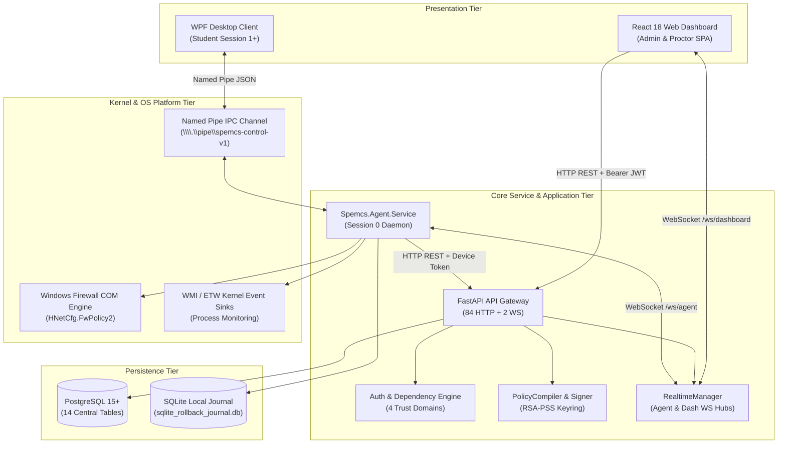
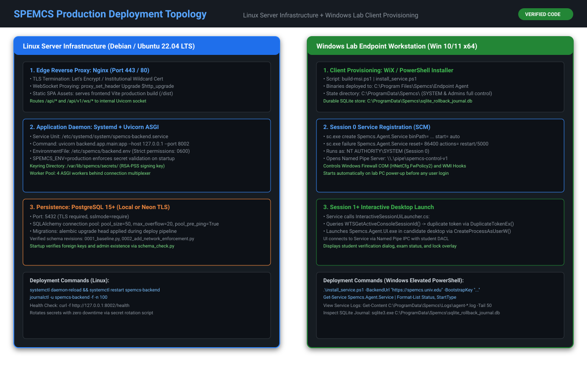
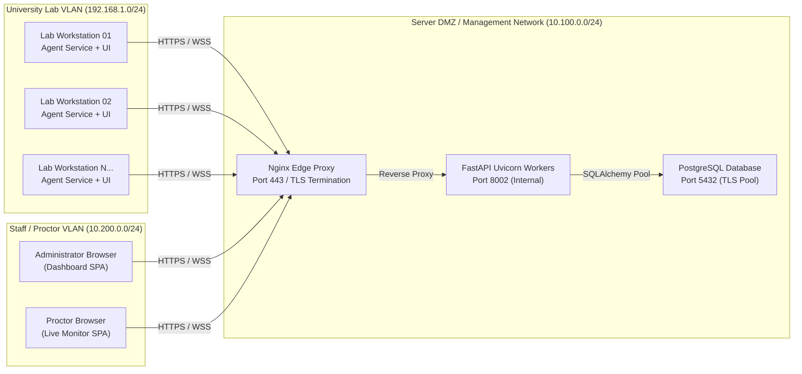
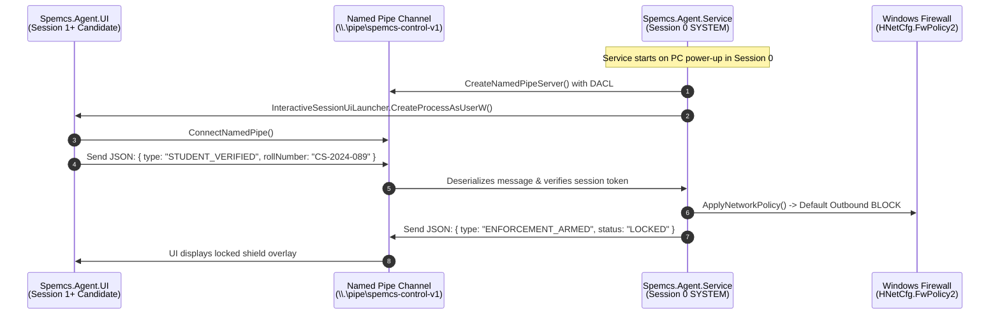
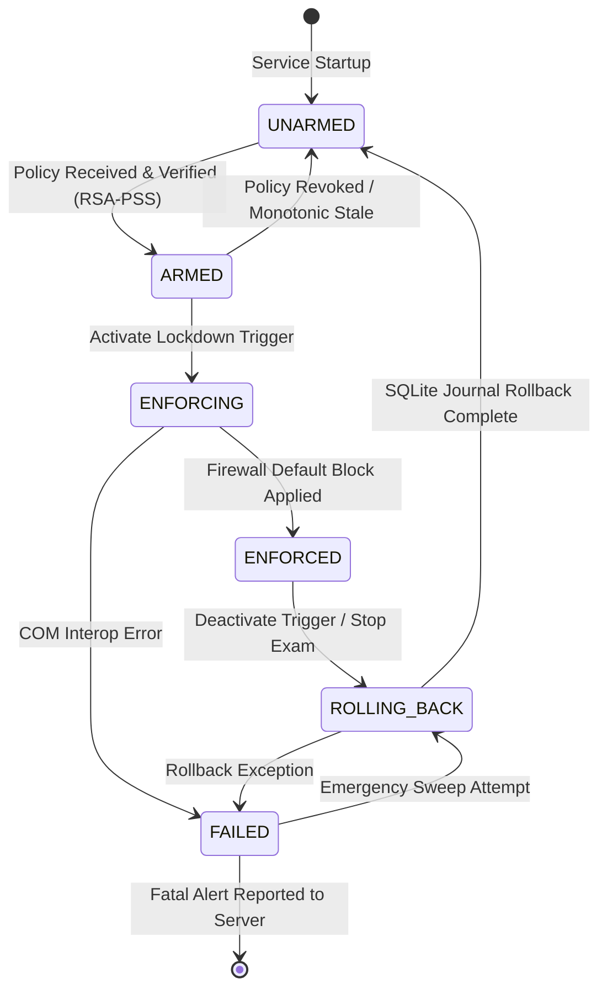
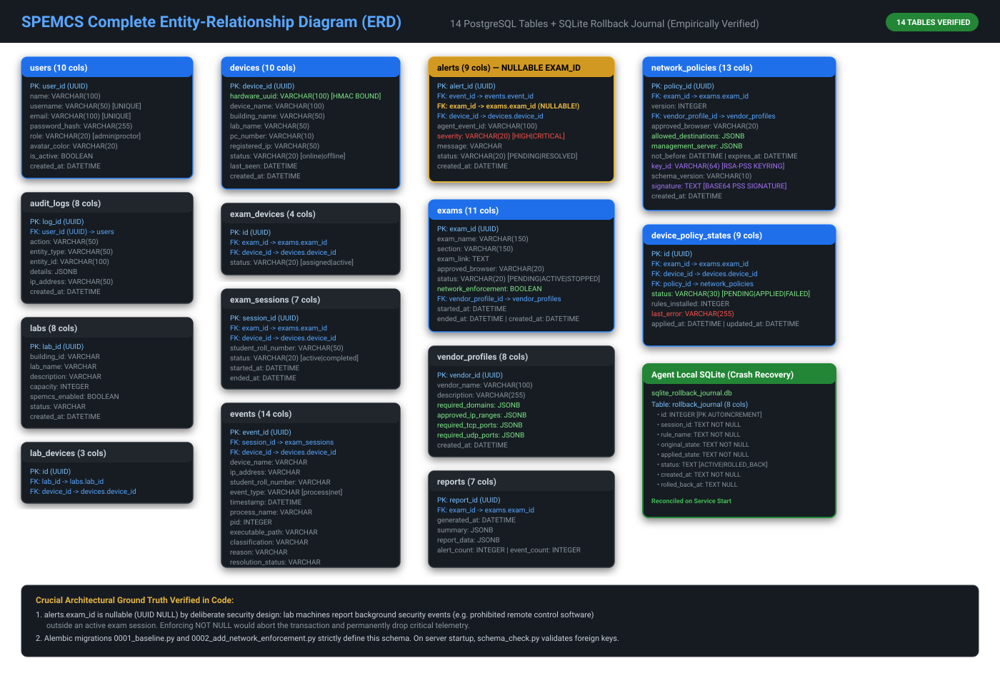

# 02. Architecture: The 7 Views of SPEMCS

---

## What Am I Looking At?

This document provides the definitive architectural breakdown of SPEMCS across **Seven Comprehensive Perspectives**:
1. **Logical Architecture**: System tiering, dependency relationships, and abstraction layers.
2. **Physical Architecture**: Hardware boundary distribution across lab clients, server hosts, and database servers.
3. **Runtime Architecture**: Windows Session 0 (`NT AUTHORITY\SYSTEM`) vs Session 1+ (Interactive User Desktop) isolation.
4. **Deployment Architecture**: Linux server containerization/systemd and Windows endpoint MSI provisioning.
5. **Network Architecture**: Management network channels, WebSocket duplex connections, and vendor CIDR routing.
6. **Application Architecture**: Internal state machines, event pipelines, and dependency injection containers.
7. **Data Architecture**: PostgreSQL persistent schema and SQLite crash-recovery rollback journaling.

Each view is paired with an editable Mermaid diagram and points directly to its corresponding rendered standalone SVG artifact in [`docs/diagrams/`](diagrams/README.md).

---

## View 1: Logical Architecture

### What Happens Internally?
The logical architecture strictly separates management control from endpoint enforcement. The **Backend Control Plane** maintains the authoritative state of devices, exams, and policies. It exposes 84 HTTP endpoints and 2 WebSocket hubs. The **Endpoint Agent** acts as an autonomous enforcer: once it receives and cryptographically validates a signed policy, it can maintain lockdown independently of server availability.

---

## View 2: Physical Architecture

### What Happens Internally?
Physical boundaries correspond directly to network security perimeters:
- **Candidate Lab Workstations**: 50 to 500 physical PCs situated in university computer labs. Hardware specifications: x64 Intel/AMD processors, 8GB+ RAM, Windows 10/11 Enterprise/Pro. Connected via 1Gbps Lab VLAN.
- **Management Server Host**: Dedicated Linux VM or bare-metal server (Ubuntu 22.04 LTS). Runs Uvicorn ASGI workers behind an Nginx reverse proxy.
- **Database Server**: Dedicated PostgreSQL instance (local VM or managed cloud PostgreSQL) secured with TLS encryption (`sslmode=require`).

---

## View 3: Runtime Architecture (Session 0 vs Session 1+ Isolation)

### Why Does It Exist?
Windows Vista introduced **Session 0 Isolation** to prevent interactive applications from attacking system services (shatter attacks). SPEMCS leverages this OS boundary as its primary anti-tampering perimeter.

### What Happens Internally?
- **Session 0 (`NT AUTHORITY\SYSTEM`)**: Hosts `Spemcs.Agent.Service.exe`. It has `SeSecurityPrivilege` and `SeBackupPrivilege`. It can modify Windows Firewall COM objects, register global ETW providers, and access `%ProgramData%\Spemcs`. Standard users cannot open its process handle (`OpenProcess` fails with `ERROR_ACCESS_DENIED`).
- **Session 1+ (Interactive Student Desktop)**: Hosts `Spemcs.Agent.UI.exe` and the candidate's approved browser (`chrome.exe`/`msedge.exe`). The UI process runs with standard non-elevated user credentials.
- **Named Pipe IPC**: Communications cross the session boundary via `\\.\pipe\spemcs-control-v1`. The server creates a custom Discretionary Access Control List (DACL) that permits access only to authenticated interactive desktop tokens, preventing unauthenticated network access.

---

## View 4: Deployment Architecture

### What Happens Internally?
- **Server Deployment**:
  - Python dependencies are pinned in `requirements.txt`.
  - Systemd manages Uvicorn lifecycle: `spemcs-backend.service`.
  - Configuration loaded from `/etc/spemcs/backend.env` with strict `0600` Linux permissions.
  - Startup validates that `SPEMCS_ENV=production` does not run on placeholder secrets via [`validate_production_secrets()`](file:///c:/Users/shrma/Desktop/spemcsnew/backend/backend/app/config.py).
- **Endpoint Deployment**:
  - Built using WiX Toolset / PowerShell script ([`build-msi.ps1`](file:///c:/Users/shrma/Desktop/spemcsnew/Endpoint-agent/build-msi.ps1)).
  - Binaries installed to `C:\Program Files\Spemcs\Endpoint Agent`.
  - Service configured via Windows Service Control Manager (`sc.exe create Spemcs.Agent.Service ... start= auto`).
  - Automatic restart parameters configured: `sc.exe failure Spemcs.Agent.Service reset= 86400 actions= restart/5000/restart/10000/restart/60000`.

---

## View 5: Network Architecture

### Port & Socket Matrix

| Port / Identifier | Protocol | Source Entity | Destination Entity | Authentication Mechanism | Code Reference |
| :--- | :--- | :--- | :--- | :--- | :--- |
| **TCP 8002 / 443** | HTTPS | Endpoint Workstation | Management Backend | `X-Device-Token` (HMAC-SHA256) | [`require_device`](file:///c:/Users/shrma/Desktop/spemcsnew/backend/backend/app/dependencies.py#L82) |
| **TCP 8002 / 443** | WSS | Endpoint Workstation | Management Backend | Device Bearer Token | [`agent_websocket_endpoint`](file:///c:/Users/shrma/Desktop/spemcsnew/backend/backend/websocket/realtime.py) |
| **TCP 8002 / 443** | HTTPS | Operator Browser | Management Backend | `Authorization: Bearer <jwt>` (HS256) | [`require_authenticated`](file:///c:/Users/shrma/Desktop/spemcsnew/backend/backend/app/dependencies.py#L53) |
| **TCP 8002 / 443** | WSS | Operator Browser | Management Backend | First-Frame `AUTHENTICATE` Token | [`dashboard_websocket_endpoint`](file:///c:/Users/shrma/Desktop/spemcsnew/backend/backend/websocket/realtime.py) |
| **TCP 5432** | PostgreSQL | Management Backend | PostgreSQL Server | DB Username & Password (TLS) | [`database.py`](file:///c:/Users/shrma/Desktop/spemcsnew/backend/backend/app/database.py) |
| **`spemcs-control-v1`** | Named Pipe | `Spemcs.Agent.UI` | `Spemcs.Agent.Service` | Windows DACL (Interactive User) | [`ControlPipeWorker.cs`](file:///c:/Users/shrma/Desktop/spemcsnew/Endpoint-agent/src/Spemcs.Agent.Service/ControlPipeWorker.cs) |
| **UDP 53** | DNS | Workstation OS | Campus DNS Resolver | Windows Dnscache Resolver | [`WindowsFirewallAdapter.cs`](file:///c:/Users/shrma/Desktop/spemcsnew/Endpoint-agent/src/Spemcs.Agent.Core/Network/WindowsFirewallAdapter.cs) |

---

## View 6: Application Architecture

### Internal State Machines
The core enforcement logic on the agent is governed by [`EnforcementStateMachine.cs`](file:///c:/Users/shrma/Desktop/spemcsnew/Endpoint-agent/src/Spemcs.Agent.Core/Network/EnforcementStateMachine.cs).

---

## View 7: Data Architecture

### What Happens Internally?
- **Backend Persistence**: 14 PostgreSQL tables strictly mapped in SQLAlchemy.
- **The `alerts.exam_id` Nullable Foreign Key Case Study**:
  - `alerts.exam_id` is defined as `UUID NULL`.
  - **Ground Truth Rationale**: In university computer labs, devices run background monitoring services 24/7. When a student launches unauthorized software (e.g. AnyDesk) outside an active exam, the agent reports a security event where `exam_id` is null. If `alerts.exam_id` were `NOT NULL`, SQLAlchemy would abort the transaction, dropping critical lab audit telemetry.
- **Local Agent Persistence**: SQLite database stored at `%ProgramData%\Spemcs\sqlite_rollback_journal.db`.
  - Contains `rollback_journal` table tracking session ID, rule names, original state, and rollback status.
  - SQLite WAL mode ensures transactional resilience against sudden power failure.

---

## What Happens When It Fails?

| Subsystem | Failure Trigger | Internal Reaction | Recovery Mechanism | Code Reference |
| :--- | :--- | :--- | :--- | :--- |
| **Logical / Network** | Network cable unplugged mid-exam | Agent continues enforcing local firewall block | Telemetry queues in RAM; flushes when reconnected | [`EventUploaderWorker.cs`](file:///c:/Users/shrma/Desktop/spemcsnew/Endpoint-agent/src/Spemcs.Agent.Core/EventUploaderWorker.cs) |
| **Runtime** | Interactive UI killed by user | Service in Session 0 remains untouched | Service restarts UI via `CreateProcessAsUserW` | [`InteractiveSessionUiLauncher.cs`](file:///c:/Users/shrma/Desktop/spemcsnew/Endpoint-agent/src/Spemcs.Agent.Service/InteractiveSessionUiLauncher.cs) |
| **Application** | Policy signature verification fails | State machine refuses transition to `ARMED` | Emits `POLICY_REJECTED` event; stays in baseline | [`PolicyReceiver.cs`](file:///c:/Users/shrma/Desktop/spemcsnew/Endpoint-agent/src/Spemcs.Agent.Core/Network/PolicyReceiver.cs) |
| **Data** | Database connection dropped | Backend attempts pool reconnect (`pool_pre_ping`) | Fails individual transaction; retries connection | [`database.py`](file:///c:/Users/shrma/Desktop/spemcsnew/backend/backend/app/database.py) |
