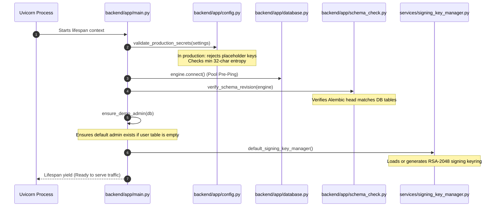
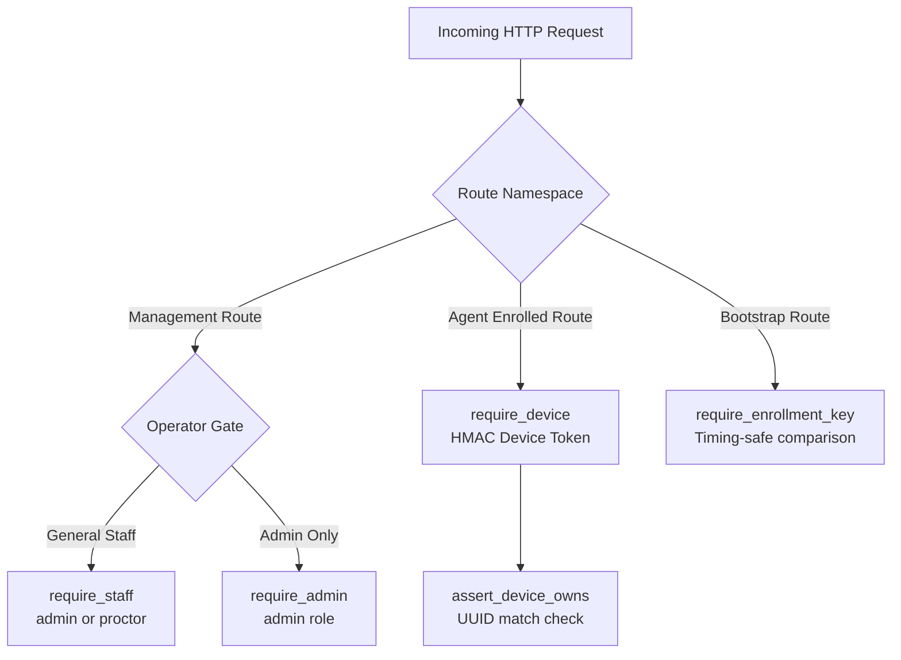

# 05. Backend Architecture & API Engine

---

## What Am I Looking At?

This document is the complete technical architectural guide to the **SPEMCS Backend Management Server**. Built with **Python 3.11+** and **FastAPI**, it serves as the authoritative control plane for device registration, policy compilation, RSA-PSS signature distribution, exam state machines, and real-time WebSocket multiplexing.

---

## Why Does It Exist?

Without a secure central control plane:
- Workstation agents would lack an authoritative source for policy compilation and public key verification.
- Cheating alerts would remain isolated on local hard drives rather than appearing on proctor screens in real time.
- Examination scheduling, student session tracking, and post-exam integrity audit reporting could not be synchronized across hundreds of lab workstations.

---

## What Happens Internally?

### 1. Application Startup & Lifespan Sequence
When Uvicorn launches [`main.py`](file:///c:/Users/shrma/Desktop/spemcsnew/backend/backend/app/main.py), it executes a strict, fail-closed initialization pipeline:



### 2. Router Registration Matrix
The backend mounts routers across two primary path namespaces:
- Management Routes (`/api/*`): CRUD operations for exams, labs, devices, reports, audit logs.
- Agent Integration Routes (`/api/v1/*`): Device enrollment, heartbeats, event ingestion, and policy distribution.

Total verified endpoints: **84 HTTP operations across 59 paths + 2 WebSocket routes = 86 endpoints**.

---

## Which Code Implements It?

### Dependency Injection & Security Gates

Located in [`backend/backend/app/dependencies.py`](file:///c:/Users/shrma/Desktop/spemcsnew/backend/backend/app/dependencies.py).



#### 1. `require_authenticated`, `require_staff`, `require_admin`
- **Purpose**: Authenticates human operators carrying a JWT.
- **Algorithm**: `HS256` signed by `settings.SECRET_KEY`.
- **Expiry**: 480 minutes (8 hours).
- **Code**:
  ```python
  require_staff = require_role([UserRole.ADMIN.value, UserRole.PROCTOR.value])
  require_admin = require_role([UserRole.ADMIN.value])
  ```

#### 2. `require_device` & `assert_device_owns`
- **Purpose**: Authenticates enrolled lab workstations carrying an HMAC token.
- **Algorithm**: HMAC-SHA256 over canonical JSON hardware claims, signed by `settings.DEVICE_TOKEN_SECRET`.
- **Expiry**: 30 days.
- **Ownership Verification**:
  ```python
  def assert_device_owns(device: DeviceIdentity, claimed_hardware_uuid: Optional[str], *, what: str) -> None:
      if claimed_hardware_uuid and str(claimed_hardware_uuid) != device.hardware_uuid:
          raise HTTPException(status_code=403, detail=f"Device token is not authorized for this {what}")
  ```

#### 3. `require_enrollment_key`
- **Purpose**: Narrow gate protecting `/api/v1/devices/register` and `/api/v1/enrollment/labs`.
- **Timing Attack Resistance**:
  ```python
  if not x_enrollment_key or not hmac.compare_digest(
      x_enrollment_key.encode("utf-8"),
      expected.encode("utf-8")
  ):
      raise HTTPException(status_code=401, detail="Invalid or missing enrollment bootstrap key")
  ```

---

## WebSockets Implementation: `/ws/agent` and `/ws/dashboard`

Located in [`backend/backend/websocket/realtime.py`](file:///c:/Users/shrma/Desktop/spemcsnew/backend/backend/websocket/realtime.py).

### 1. Agent Channel: `/api/v1/ws/agent`
- **Purpose**: Duplex connection between endpoint service and server.
- **Handshake**: Device presents token in header/query; backend validates against `DEVICE_TOKEN_SECRET`.
- **Heartbeat**: 30-second ping interval with 10-second response timeout.
- **Frame Types**:
  - `AGENT_HELLO`: Identifies agent version and capabilities.
  - `HEARTBEAT`: Reports live memory, CPU, and process count.
  - `POLICY_STATUS`: Syncs current firewall state (`ARMED`, `ENFORCED`).

### 2. Dashboard Channel: `/api/v1/ws/dashboard`
- **Purpose**: Real-time event and alert stream for proctors.
- **First-Frame Auth Handshake**:
  1. Client connects via `new WebSocket('/api/v1/ws/dashboard')`.
  2. Server accepts connection and starts a 5-second auth timer.
  3. Client MUST send: `{ "type": "AUTHENTICATE", "token": "<jwt>" }`.
  4. If invalid: server closes connection with code `4401` (Unauthorized).
  5. If user lacks `admin`/`proctor` role: closes with code `4403` (Forbidden).
- **Broadcast Messages**:
  - `ALERT_CREATED`: Emitted when an unauthorized process or network violation occurs.
  - `DEVICE_UPDATE`: Emitted on device heartbeat or status change.
  - `EXAM_STATE`: Emitted when an exam is activated or stopped.

---

## What Happens When It Fails?

| Failure Scenario | Detection Mechanism | System Reaction | Recovery Action | Source Reference |
| :--- | :--- | :--- | :--- | :--- |
| **Invalid Production Secret** | `validate_production_secrets()` on boot | Process raises `RuntimeError` and refuses to start | Operator must set non-placeholder secrets in `.env` | [`config.py`](file:///c:/Users/shrma/Desktop/spemcsnew/backend/backend/app/config.py#L180) |
| **Alembic Schema Mismatch** | `verify_schema_revision()` on boot | Throws `SchemaVersionMismatchError` | Run `alembic upgrade head` before restarting | [`schema_check.py`](file:///c:/Users/shrma/Desktop/spemcsnew/backend/backend/app/schema_check.py) |
| **PostgreSQL Disconnect** | `pool_pre_ping=True` in SQLAlchemy | Closes dead connection and attempts pool reconnect | Transparent to routes if DB returns within timeout | [`database.py`](file:///c:/Users/shrma/Desktop/spemcsnew/backend/backend/app/database.py) |
| **WebSocket Heartbeat Timeout** | 10s timeout in `realtime.py` | Prunes dead connection from active dictionary | Client initiates exponential backoff reconnect | [`realtime.py`](file:///c:/Users/shrma/Desktop/spemcsnew/backend/backend/websocket/realtime.py) |
