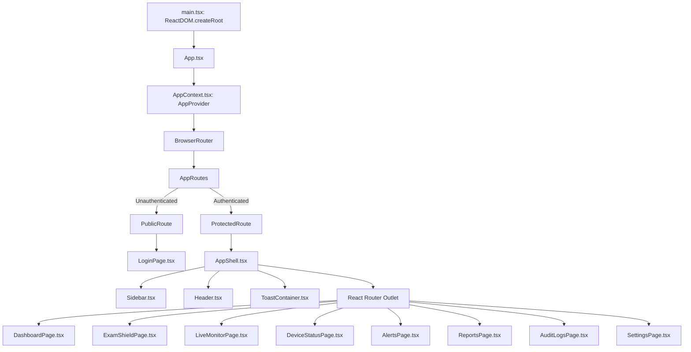
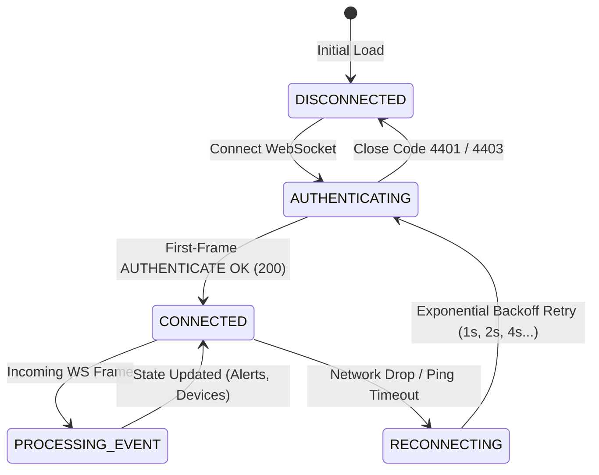

# 06. Frontend Architecture & Operator Dashboard

---

## What Am I Looking At?

This document is the technical architectural guide for the **SPEMCS Operator Dashboard**. Built with **React 18**, **Vite**, **TypeScript**, and **TailwindCSS**, it provides administrators and proctors with an intuitive, real-time command interface to configure exams, monitor lab workstations, and triage security violations.

---

## Why Does It Exist?

During an active examination across several computer labs containing hundreds of candidates:
- Proctors cannot physically look at 100+ monitors simultaneously.
- When an endpoint agent detects an unauthorized process (e.g. AnyDesk) or blocked network attempt, the proctor requires an **immediate, low-latency visual alert** indicating the student's name, roll number, lab PC number, and offending process.
- Administrators need a unified portal to compile network security policies, assign workstations, and verify fleet arming readiness before launching an exam.

---

## What Happens Internally?

### 1. Application Initialization & Component Tree



### 2. Layout & Route Guards
Located in [`frontend/src/App.tsx`](file:///c:/Users/shrma/Desktop/spemcsnew/frontend/src/App.tsx):
- `PublicRoute`: Renders child components only when `!isAuthenticated`. If already authenticated, automatically redirects to `/dashboard`.
- `ProtectedRoute`: Checks `isAuthenticated` from `useApp()`. If unauthenticated, captures the attempted path in `state={{ from: location }}` and redirects to `/login`.
- `AppShell`: Wraps all protected views with persistent navigation: sidebar with route icons, global notifications, and operator profile controls.

---

## Which Code Implements It?

### Global State Management: `AppContext.tsx`

Located in [`frontend/src/context/AppContext.tsx`](file:///c:/Users/shrma/Desktop/spemcsnew/frontend/src/context/AppContext.tsx).



#### Key State Variables:
- `user`: Authenticated operator object (`user_id`, `name`, `email`, `role`, `avatar_color`).
- `token`: Operator JWT stored in `localStorage` and memory.
- `alerts`: List of incoming alerts updated in real time.
- `devices`: Live device status map keyed by `device_id`.
- `wsConnected`: Boolean indicating active WebSocket connection.

---

## The 9 Verified Primary UI Views

```text
Screenshot Status: NOT CAPTURED
Reason: Live codebase under active maintenance; background development servers avoided to prevent file lock contention on running client binaries.
What Was Verified Instead: Component JSX/TSX structure, routing definitions, API fetch hooks, and Tailwind CSS layout classes verified directly in source code.
```

### 1. `LoginPage.tsx`
- **Route**: `/login`
- **Source**: [`frontend/src/pages/LoginPage.tsx`](file:///c:/Users/shrma/Desktop/spemcsnew/frontend/src/pages/LoginPage.tsx)
- **Features**: Username and password credentials input; calls `POST /api/auth/token`; stores JWT in `localStorage` upon success.

### 2. `DashboardPage.tsx`
- **Route**: `/dashboard`
- **Source**: [`frontend/src/pages/DashboardPage.tsx`](file:///c:/Users/shrma/Desktop/spemcsnew/frontend/src/pages/DashboardPage.tsx)
- **Features**: Aggregated metrics tiles (Active Exams, Enrolled Devices, Open Alerts, Total Labs); quick-action buttons for common workflows.

### 3. `ExamShieldPage.tsx`
- **Route**: `/exam-shield`
- **Source**: [`frontend/src/pages/ExamShieldPage.tsx`](file:///c:/Users/shrma/Desktop/spemcsnew/frontend/src/pages/ExamShieldPage.tsx)
- **Features**: Exam scheduling and lockdown command center. Displays vendor profiles (Moodle, Canvas, Blackboard) and verifies **Enforcement Readiness** before permitting exam activation.

### 4. `LiveMonitorPage.tsx`
- **Route**: `/exam-shield/monitor/:id`
- **Source**: [`frontend/src/pages/LiveMonitorPage.tsx`](file:///c:/Users/shrma/Desktop/spemcsnew/frontend/src/pages/LiveMonitorPage.tsx)
- **Features**: Workstation grid layout representing lab seating; tiles flash red in real time when violations occur; proctor can click any tile to view live telemetry.

### 5. `DeviceStatusPage.tsx`
- **Route**: `/devices`
- **Source**: [`frontend/src/pages/DeviceStatusPage.tsx`](file:///c:/Users/shrma/Desktop/spemcsnew/frontend/src/pages/DeviceStatusPage.tsx)
- **Features**: Complete catalog of lab workstations; reports heartbeat status (Online/Offline), registered IP, building, lab name, and hardware UUID.

### 6. `AlertsPage.tsx`
- **Route**: `/alerts`
- **Source**: [`frontend/src/pages/AlertsPage.tsx`](file:///c:/Users/shrma/Desktop/spemcsnew/frontend/src/pages/AlertsPage.tsx)
- **Features**: Filterable table of security alerts (CRITICAL, HIGH, MEDIUM); proctors can click "Resolve" to record an explanation in `audit_logs`.

### 7. `ReportsPage.tsx`
- **Route**: `/reports`
- **Source**: [`frontend/src/pages/ReportsPage.tsx`](file:///c:/Users/shrma/Desktop/spemcsnew/frontend/src/pages/ReportsPage.tsx)
- **Features**: Post-exam audit reporting; summary cards for total alerts and events; student and device timeline visualization; CSV export button.

### 8. `AuditLogsPage.tsx`
- **Route**: `/audit-logs`
- **Source**: [`frontend/src/pages/AuditLogsPage.tsx`](file:///c:/Users/shrma/Desktop/spemcsnew/frontend/src/pages/AuditLogsPage.tsx)
- **Features**: Immutable chronological record of all administrative actions (logins, policy rotations, exam activations, alert resolutions).

### 9. `SettingsPage.tsx`
- **Route**: `/settings`
- **Source**: [`frontend/src/pages/SettingsPage.tsx`](file:///c:/Users/shrma/Desktop/spemcsnew/frontend/src/pages/SettingsPage.tsx)
- **Features**: Cryptographic keyring status; displays active RSA public key fingerprint; administrative trigger for key rotation and revocation.

---

## What Happens When It Fails?

| Failure Mode | Detection Mechanism | Frontend Reaction | User Experience |
| :--- | :--- | :--- | :--- |
| **Expired JWT Token** | API returns 401 Unauthorized | `fetch` interceptor calls `logout()` | Redirects to `/login` with notification: "Session expired" |
| **Insufficient Privileges** | API returns 403 Forbidden | Catches 403 response | Displays red error toast: "Access Denied: Requires Administrator privileges" |
| **WebSocket Dropped** | `ws.onclose` event triggered | Enters reconnect loop | Displays warning banner: "Reconnecting to live monitoring stream..." |
| **Exam Activation Blocked** | API returns 409 Conflict | Parses readiness JSON | Modal displays exact reasons (e.g., "3 workstations are offline or unarmed") |
