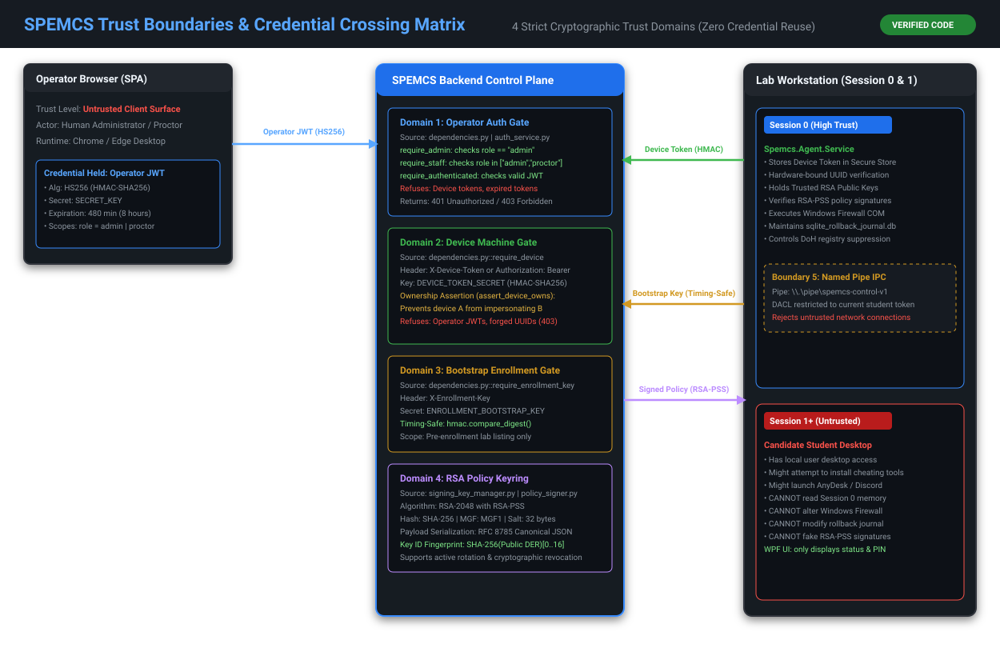
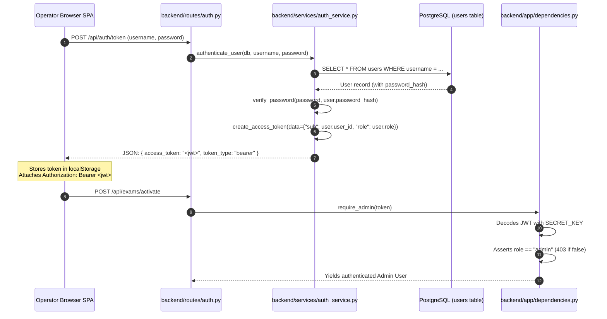
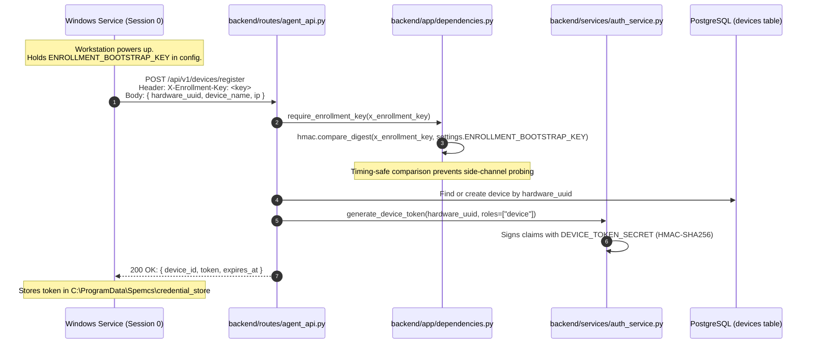
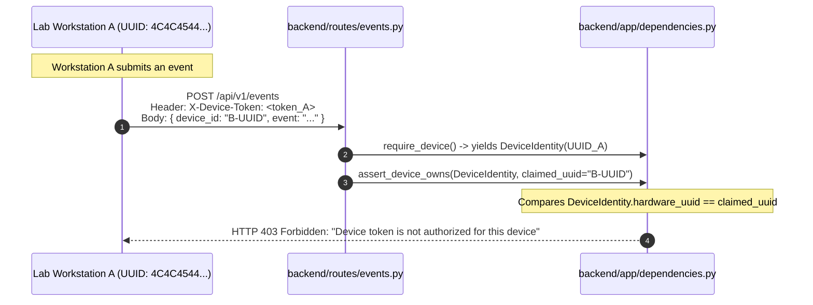
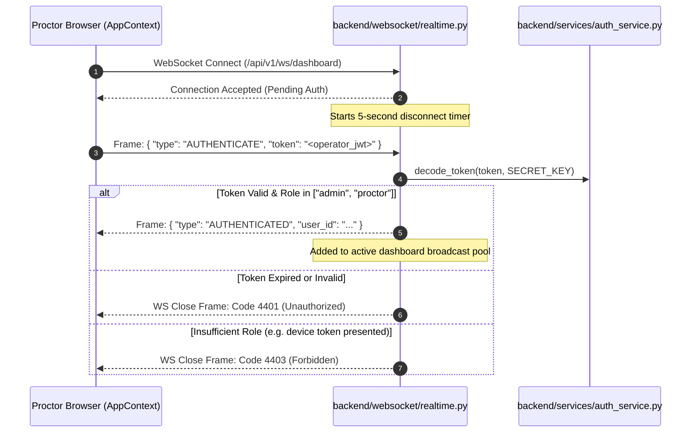

# 09. Authentication, Authorization & Cryptographic Trust Domains

---

## What Am I Looking At?



This document is the authoritative cryptographic reference for SPEMCS authentication and authorization. Rather than using a single shared secret or generic JWT across the system, SPEMCS implements **Four Strictly Separated Trust Domains**:

1. **Operator Identity**: Human staff carrying a Bearer JWT signed by `SECRET_KEY`.
2. **Device Identity**: Enrolled lab machines carrying an HMAC token signed by `DEVICE_TOKEN_SECRET`.
3. **Enrollment Bootstrap**: Installation secret compared in constant-time via `ENROLLMENT_BOOTSTRAP_KEY`.
4. **Policy Integrity**: Cryptographic keyring using RSA-2048 with RSA-PSS (SHA-256) signatures.

```text
Evidence Standard:
File: backend/app/dependencies.py & backend/services/auth_service.py
Evidence: Explicit separation of operator gates vs require_device vs require_enrollment_key
Verification: 469 hermetic security tests passing in test_auth_security.py
Confidence: ✅ VERIFIED
```

---

## Why Does It Exist?

In multi-tier systems, credential confusion is a leading cause of severe security vulnerabilities:
- **Token Confusion Attack**: If a machine token can be used on an administrative endpoint, an attacker who extracts a device token from a lab PC can elevate privileges to administrator and alter exam grades.
- **Workstation Impersonation**: If authentication only verifies "is this a valid machine token" without asserting "does this token belong to PC #14", Workstation A can submit fake violation events attributed to Workstation B.
- **Timing Attacks on Static Secrets**: Using standard string comparison (`==`) on bootstrap keys leaks secret length and byte values through microsecond response timing differences.

---

## The 4 Distinct Trust Domains

| Trust Domain | Subject | Secret Configuration | Cryptographic Algorithm | Token Lifetime | Scope & Purpose |
| :--- | :--- | :--- | :--- | :--- | :--- |
| **1. Operator JWT** | Human (`admin`, `proctor`) | `SECRET_KEY` | HS256 (HMAC-SHA256) | 480 minutes (8 hours) | Management CRUD, activating exams, resolving alerts. |
| **2. Device Token** | Machine (Hardware UUID) | `DEVICE_TOKEN_SECRET` | HMAC-SHA256 over Canonical JSON | 30 days | Heartbeats, process telemetry, policy fetching. |
| **3. Bootstrap Key** | Unenrolled Workstation | `ENROLLMENT_BOOTSTRAP_KEY` | Timing-Safe String (`hmac.compare_digest`) | Static pre-shared key | Initial machine registration (`POST /api/v1/devices/register`). |
| **4. Policy Keyring** | Network Policy Document | `SIGNING_KEY_DIR` | RSA-2048, RSA-PSS (SHA-256, MGF1) | Policy validity window | Immutable firewall lockdown distribution. |

---

## What Happens Internally?

### 1. Operator Login & Session Lifecycle



---

### 2. Workstation Bootstrap Enrollment & Device Token Issuance



---

### 3. Device Ownership Verification (`assert_device_owns`)



---

### 4. First-Frame WebSocket Handshake (`/api/v1/ws/dashboard`)



---

## Which Code Implements It?

### 1. `backend/backend/app/dependencies.py`
- [`require_authenticated`](file:///c:/Users/shrma/Desktop/spemcsnew/backend/backend/app/dependencies.py#L53): General operator gate.
- [`require_staff`](file:///c:/Users/shrma/Desktop/spemcsnew/backend/backend/app/dependencies.py#L56): `admin` and `proctor` roles.
- [`require_admin`](file:///c:/Users/shrma/Desktop/spemcsnew/backend/backend/app/dependencies.py#L59): `admin` role only.
- [`require_device`](file:///c:/Users/shrma/Desktop/spemcsnew/backend/backend/app/dependencies.py#L82): Enrolled machine gate.
- [`assert_device_owns`](file:///c:/Users/shrma/Desktop/spemcsnew/backend/backend/app/dependencies.py#L129): Workstation ownership check.
- [`require_enrollment_key`](file:///c:/Users/shrma/Desktop/spemcsnew/backend/backend/app/dependencies.py#L168): Timing-safe bootstrap gate.

### 2. `backend/backend/services/auth_service.py`
- `verify_password(plain, hashed)`: Secure password check.
- `create_access_token(data, expires_delta)`: Issues operator JWTs.
- `verify_device_token(token)`: Validates machine HMAC tokens.

### 3. `backend/backend/services/signing_key_manager.py`
- `SigningKeyManager.sign_policy(payload)`: Applies RSA-PSS SHA-256 signatures.
- `SigningKeyManager.verify_policy(payload, signature)`: Validates policy integrity.

---

## What Happens When It Fails?

| Violation Condition | Gate Encountered | HTTP / WS Code | Internal Error Detail |
| :--- | :--- | :--- | :--- |
| Missing Authorization header | `require_authenticated` | `401 Unauthorized` | `"Not authenticated"` |
| Expired operator JWT | `require_authenticated` | `401 Unauthorized` | `"Could not validate credentials"` |
| Proctor calls `/api/exams/activate` | `require_admin` | `403 Forbidden` | `"Operation requires administrator privileges"` |
| Device token used on management route | `require_staff` | `401 Unauthorized` | Rejects non-JWT format |
| Malformed or forged device token | `require_device` | `401 Unauthorized` | Uniform message: `"Invalid or expired device token"` |
| Device A submits event for Device B | `assert_device_owns` | `403 Forbidden` | `"Device token is not authorized for this event"` |
| Wrong bootstrap key on enrollment | `require_enrollment_key` | `401 Unauthorized` | `"Invalid or missing enrollment bootstrap key"` |
| Dashboard WS timeout (>5s without auth) | `dashboard_websocket` | Close `4401` | Disconnects pending socket |
