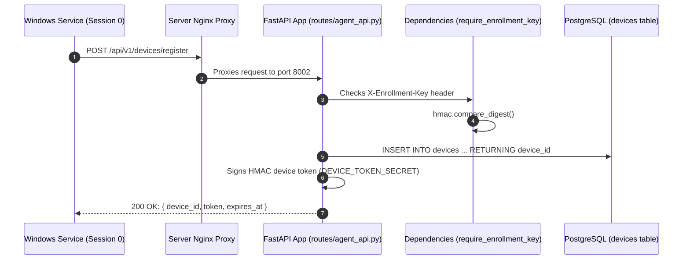
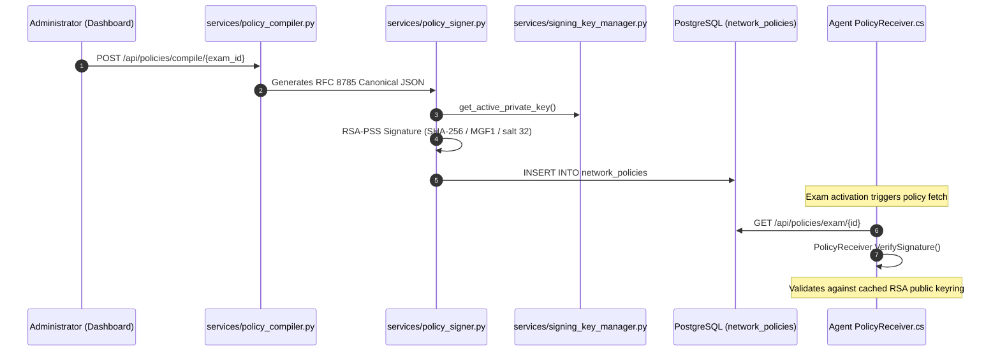
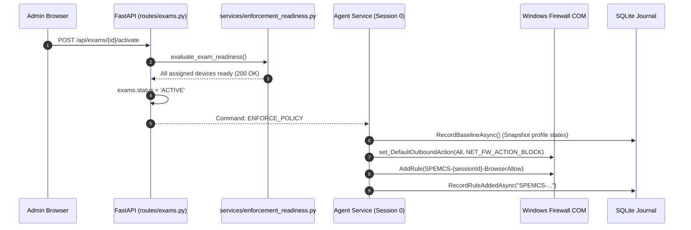
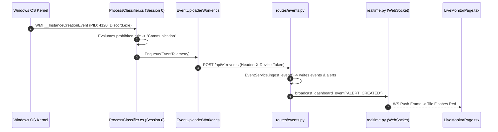
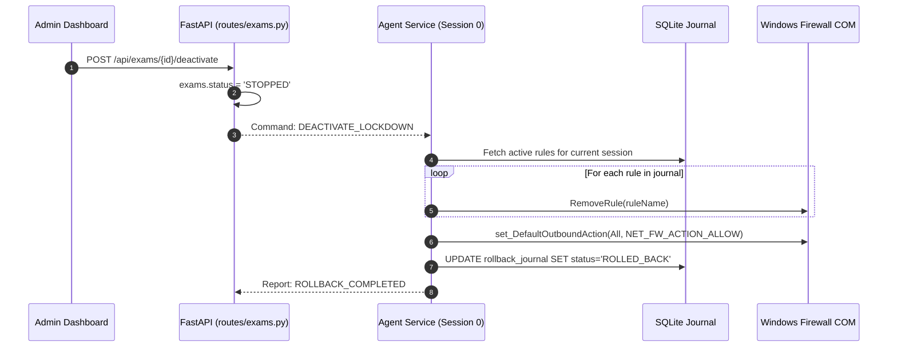

# 13. Data Flows: Follow the Packet, Request & Event

---

## What Am I Looking At?


This document is the dedicated **"Follow the Information"** reference manual for SPEMCS. It traces the lifecycle of packets, HTTP requests, IPC messages, and telemetry events across the entire architecture.

To prevent diagram clutter, every data flow is split into three progressive levels of depth:
- **Level 1: Conceptual**: What occurs from a high-level operational perspective.
- **Level 2: Subsystem**: How components, network boundaries, and sockets interact.
- **Level 3: Implementation**: Exact call stacks, header fields, JSON payloads, and SQL queries.

---

## Flow 1: Device Registration & Enrollment

### Level 1: Conceptual
A new lab computer powers on. The background Windows service starts, recognizes that it has no saved machine credential, reaches out to the management server presenting an installation password, and receives a permanent machine identity card.

### Level 2: Subsystem


### Level 3: Implementation Code Trace
1. **Endpoint Initiation**:
   - Class: [`DeviceCredentialStore.cs`](file:///c:/Users/shrma/Desktop/spemcsnew/Endpoint-agent/src/Spemcs.Agent.Service/DeviceCredentialStore.cs)
   - Method: `EnsureEnrolledAsync()`
   - Payload:
     ```json
     {
       "hardware_uuid": "4C4C4544-004D-4A10-8053-C8C04F343232",
       "device_name": "LAB-B-PC-14",
       "registered_ip": "192.168.1.114"
     }
     ```
   - Headers: `X-Enrollment-Key: spemcs-enrollment-bootstrap-key-default`.
2. **Backend Authentication & Ownership**:
   - Gate: `dependencies.py::require_enrollment_key(x_enrollment_key)`
   - Handler: `routes/agent_api.py::register_device(db, payload)`
   - Database Query:
     ```sql
     INSERT INTO devices (device_id, hardware_uuid, device_name, status, created_at)
     VALUES ('8a329d48...', '4C4C4544...', 'LAB-B-PC-14', 'ONLINE', NOW())
     ON CONFLICT (hardware_uuid) DO UPDATE SET last_seen = NOW();
     ```
3. **Credential Storage**:
   - Token stored in DPAPI-protected store on client: `C:\ProgramData\Spemcs\credential_store`.

---

## Flow 2: Policy Compilation, RSA-PSS Signing & Distribution

### Level 1: Conceptual
An administrator selects an exam and clicks "Compile Policy". The server gathers all required vendor IP addresses, formats them into a strict document, stamps an unbreakable digital signature on the bottom using an RSA private key, and stores it. When the exam starts, endpoints fetch and verify this signed document.

### Level 2: Subsystem


### Level 3: Implementation Code Trace
1. **Compilation Engine**:
   - Source: [`backend/backend/services/policy_compiler.py`](file:///c:/Users/shrma/Desktop/spemcsnew/backend/backend/services/policy_compiler.py)
   - Function: `compile_exam_policy(exam_id, db)`
   - Assembles:
     ```json
     {
       "schema_version": "2.0",
       "exam_id": "18f921bb-442a-4467-8cfb-81014da40348",
       "version": 1,
       "approved_browser": "chrome",
       "allowed_destinations": ["198.51.100.0/24", "203.0.113.5"],
       "management_server": ["10.100.0.5"],
       "not_before": "2026-09-06T02:00:00Z",
       "expires_at": "2026-09-06T06:00:00Z",
       "key_id": "9f83a21b4e0987c1"
     }
     ```
2. **Cryptographic Signing**:
   - Source: [`backend/backend/services/policy_signer.py`](file:///c:/Users/shrma/Desktop/spemcsnew/backend/backend/services/policy_signer.py)
   - Inverted parameter verification: guarantees key ID agreements before signature.
3. **Agent Verification**:
   - Class: [`PolicyReceiver.cs`](file:///c:/Users/shrma/Desktop/spemcsnew/Endpoint-agent/src/Spemcs.Agent.Core/Network/PolicyReceiver.cs)
   - Method: `VerifySignature(rawJson, signatureBase64, keyId)`
   - C# Cryptography API: `RSA.VerifyData(..., RSASignaturePadding.Pss)`.

---

## Flow 3: Exam Activation & Lockdown Enforcement

### Level 1: Conceptual
The admin clicks "Activate Exam". The server verifies all assigned computers are online and armed. Once approved, the agent tells the Windows Firewall to block all outbound internet except for the student's browser connecting to the exam platform.

### Level 2: Subsystem


### Level 3: Implementation Code Trace
1. **Enforcement Readiness Evaluation**:
   - File: [`backend/backend/services/enforcement_readiness.py`](file:///c:/Users/shrma/Desktop/spemcsnew/backend/backend/services/enforcement_readiness.py)
   - Checks: `policy_id` exists; device `rules_installed > 0`.
2. **Firewall Mutation**:
   - File: [`WindowsFirewallAdapter.cs`](file:///c:/Users/shrma/Desktop/spemcsnew/Endpoint-agent/src/Spemcs.Agent.Core/Network/WindowsFirewallAdapter.cs)
   - COM Method: `_policy.set_DefaultOutboundAction(7, NET_FW_ACTION_BLOCK)`.
3. **Journal Logging**:
   - File: [`SqliteRollbackJournal.cs`](file:///c:/Users/shrma/Desktop/spemcsnew/Endpoint-agent/src/Spemcs.Agent.Core/Network/SqliteRollbackJournal.cs)
   - Commits active rule entries inside a transactional SQLite write lock.

---

## Flow 4: Process Telemetry & Alert Ingestion

### Level 1: Conceptual
A student launches Discord. The Windows kernel detects the new program and notifies the agent in under 50 milliseconds. The agent recognizes Discord as prohibited, transmits an alert to the server, and the proctor's screen instantly flashes red.

### Level 2: Subsystem


### Level 3: Implementation Code Trace
1. **Kernel Hook**:
   - Class: `ConfigurableProcessClassifier`
   - Trigger: `Win32_Process.Create` event.
2. **HTTP Transmission**:
   - Endpoint: `POST /api/v1/events`
   - Authentication: `require_device` validates HMAC token; asserts hardware ownership.
3. **Database & WebSocket Hand-off**:
   - File: [`backend/backend/services/event_service.py`](file:///c:/Users/shrma/Desktop/spemcsnew/backend/backend/services/event_service.py)
   - SQL: `INSERT INTO alerts (alert_id, event_id, severity, message, status) VALUES (...)`
   - WS Frame: `{ "type": "ALERT_CREATED", "payload": { "device_id": "...", "process": "Discord.exe" } }`.

---

## Flow 5: Exam Deactivation & Firewall Rollback

### Level 1: Conceptual
The exam is finished. The admin clicks "Stop Exam". The server signals the agent to dismantle all security rules. The agent reads its SQLite journal, deletes every rule it created, resets the default outbound action to allow, and reports that the machine is clean.

### Level 2: Subsystem


### Level 3: Implementation Code Trace
1. **Rollback Execution**:
   - File: [`SqliteRollbackJournal.cs`](file:///c:/Users/shrma/Desktop/spemcsnew/Endpoint-agent/src/Spemcs.Agent.Core/Network/SqliteRollbackJournal.cs)
   - Method: `RollbackSessionAsync(Guid sessionId)`
   - Iterates through all recorded rules tagged with `SPEMCS-{sessionId}`.
2. **Baseline Restoration**:
   - File: [`WindowsFirewallAdapter.cs`](file:///c:/Users/shrma/Desktop/spemcsnew/Endpoint-agent/src/Spemcs.Agent.Core/Network/WindowsFirewallAdapter.cs)
   - Reverts `DefaultOutboundAction` back to `NET_FW_ACTION_ALLOW` (0).
3. **Completion Event**:
   - Emits `ENFORCEMENT_ROLLED_BACK` event to backend server; workstation status returns to normal.
