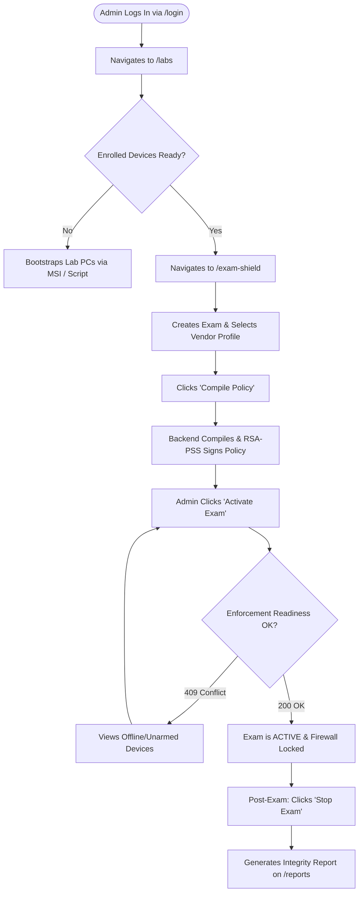
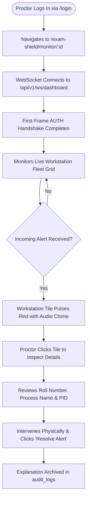
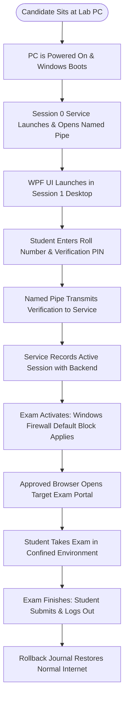

# 14. User Flows: Administrator, Proctor & Candidate Journeys

---

## What Am I Looking At?

This document outlines the complete, end-to-end user journeys for the **Three Primary Actors** in SPEMCS:
1. **The Administrator**: Institutional staff who configure lab environments, manage vendor profiles, compile policies, and activate examinations.
2. **The Proctor**: Academic invigilators who monitor active exam labs in real time and triage security violations.
3. **The Candidate (Student)**: Examinees sitting at physical computer lab workstations who verify their roll numbers and complete examinations in locked browser sessions.

---

## Why Does It Exist?

Understanding technical subsystems in isolation is insufficient; developers and evaluators must understand how human users interact with the system, what visual screens they encounter, what data they input, and how user actions translate into backend commands.

---

## 1. The Administrator Journey

### Step-by-Step Administrator Walkthrough:
1. **Authentication**: Admin accesses `https://spemcs.univ.edu/login`, enters administrative credentials, and receives an 8-hour Bearer JWT with `role: "admin"`.
2. **Lab & Device Verification**: Admin visits [`DeviceStatusPage.tsx`](file:///c:/Users/shrma/Desktop/spemcsnew/frontend/src/pages/DeviceStatusPage.tsx) to verify that lab workstations report `ONLINE` status and have active heartbeats.
3. **Vendor Profile Selection**: Admin visits [`ExamShieldPage.tsx`](file:///c:/Users/shrma/Desktop/spemcsnew/frontend/src/pages/ExamShieldPage.tsx), creates a new exam (e.g. "Data Structures Midterm"), specifies the approved browser (`chrome`), and binds the exam vendor profile (`Moodle LMS`).
4. **Policy Compilation**: Admin clicks "Compile Policy". The backend resolves all required IP CIDRs, generates canonical JSON (RFC 8785), and applies an RSA-2048 RSA-PSS signature.
5. **Pre-Flight Readiness Check**: When the admin clicks "Activate Exam", the frontend queries `GET /api/exams/{id}/enforcement-readiness`. If all devices report `rules_installed > 0`, the activation proceeds.
6. **Post-Exam Teardown**: Upon exam conclusion, the admin clicks "Stop Exam", which commands the agent to execute rollback and transition the exam status to `STOPPED`.

---

## 2. The Proctor Journey

### Step-by-Step Proctor Walkthrough:
1. **Login**: Proctor logs in and is granted a staff-scoped JWT (`role: "proctor"`).
2. **Live Monitoring Grid**: Navigates to [`LiveMonitorPage.tsx`](file:///c:/Users/shrma/Desktop/spemcsnew/frontend/src/pages/LiveMonitorPage.tsx). The screen displays a responsive visual grid representing all assigned workstation seats in the computer lab.
3. **Real-time Alert Handling**:
   - If Workstation #14 launches AnyDesk, the backend broadcasts an `ALERT_CREATED` WebSocket frame.
   - Seat #14 on the proctor's screen immediately **pulses bright red**, and a high-priority toast notification appears.
4. **Alert Triage**: Proctor clicks the pulsing tile to inspect the modal:
   - Student Name: Jane Doe
   - Roll Number: CS-2024-042
   - Process Name: `AnyDesk.exe` (PID: 4812)
   - Action: Proctor approaches the student, ensures the tool is closed, and submits an explanation: "Student opened AnyDesk by mistake; closed and warned."
5. **Resolution Logging**: Calls `PATCH /api/alerts/{id}`, marking the alert `RESOLVED` and logging the proctor's user ID and timestamp in `audit_logs`.

---

## 3. The Candidate (Student) Journey

### Step-by-Step Candidate Walkthrough:
1. **Workstation Boot**: Candidate sits at their assigned lab PC. The PC is running Windows 10/11. The service `Spemcs.Agent.Service` is already running in Session 0.
2. **Interactive UI Display**: [`InteractiveSessionUiLauncher`](file:///c:/Users/shrma/Desktop/spemcsnew/Endpoint-agent/src/Spemcs.Agent.Service/InteractiveSessionUiLauncher.cs) launches `Spemcs.Agent.UI.exe` on the desktop.
3. **Student Identification**: The student inputs their University Roll Number (e.g. `CS-2024-089`) and session PIN. The WPF app sends this over named pipes (`\\.\pipe\spemcs-control-v1`) to the service.
4. **Pre-Compliance Scan**: The service verifies that no prohibited background tools (AnyDesk, TeamViewer, Cheat Engine) are currently resident in memory.
5. **Browser Enclave Launch**: When the exam starts, the service commands the firewall into default outbound block and launches the approved browser (`chrome.exe`) directly into the exam link.
6. **Completion**: When the student finishes and submits their exam, the proctor deactivates the exam, the browser closes, and the service cleanly restores normal networking.
