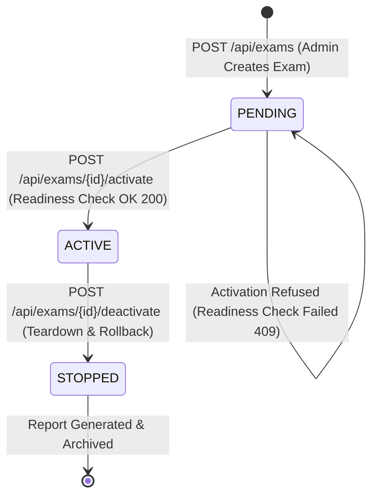
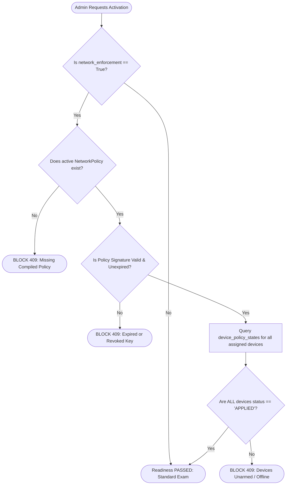

# 15. Examination Lifecycle & Server-Side Enforcement Readiness

---

## What Am I Looking At?

This document defines the formal **State Machine and Server-Side Enforcement Readiness Evaluation** governing examinations in SPEMCS. It details the transitions between `PENDING`, `ACTIVE`, and `STOPPED` states, and describes the pre-flight verification gate implemented in [`enforcement_readiness.py`](file:///c:/Users/shrma/Desktop/spemcsnew/backend/backend/services/enforcement_readiness.py) that prevents an exam from activating if workstations are offline or unarmed.

---

## Why Does It Exist?

In high-stakes academic examinations, launching an exam prematurely results in exam disruption:
- If an administrator activates an exam while 10 computers in Lab B have not yet received the policy, those 10 computers will operate with an open firewall, creating an unfair cheating opportunity.
- Conversely, if an administrator activates an exam with a corrupted policy signature, endpoints will refuse to apply it, locking students out of the exam portal.
- **Server-Side Enforcement Readiness** acts as an automated safety interlock: it interrogates the exact installation state of every assigned workstation and blocks activation until 100% of the fleet is armed.

---

## The Formal Exam State Machine



---

## Server-Side Enforcement Readiness Evaluation

Located in [`backend/backend/services/enforcement_readiness.py`](file:///c:/Users/shrma/Desktop/spemcsnew/backend/backend/services/enforcement_readiness.py).



### The Readiness Verification Checks:
1. **Policy Existence & Binding**:
   - Asserts that a record in `network_policies` exists for `exam_id`.
   - Asserts `not_before <= NOW() < expires_at`.
   - Asserts `signature` is present and non-empty.
2. **Device Fleet Coverage**:
   - Queries `exam_devices` for all workstations assigned to this exam.
   - For every device, checks the corresponding record in `device_policy_states`:
     - Must have `status == "APPLIED"`.
     - Must have `rules_installed > 0`.
     - Must have `last_error == None`.
3. **Handling Unarmed Devices**:
   - If even one assigned device is `PENDING`, `FAILED`, or `OFFLINE`, the endpoint raises **HTTP 409 Conflict**.
   - The response payload returns an itemized diagnostic list so the administrator can see exactly which physical lab PCs require attention:
     ```json
     {
       "ready": false,
       "reason": "Enforcement readiness check failed",
       "unarmed_devices": [
         {
           "device_id": "8a329d48-3162-42fe-b58f-7c1543789ab1",
           "device_name": "LAB-B-PC-14",
           "status": "PENDING",
           "rules_installed": 0,
           "last_error": "Connection timed out"
         }
       ]
     }
     ```

---

## Which Code Implements It?

- [`backend/backend/services/enforcement_readiness.py`](file:///c:/Users/shrma/Desktop/spemcsnew/backend/backend/services/enforcement_readiness.py):
  - Function: `evaluate_exam_readiness(exam_id: UUID, db: Session) -> ReadinessReport`.
- [`backend/backend/routes/exams.py`](file:///c:/Users/shrma/Desktop/spemcsnew/backend/backend/routes/exams.py):
  - Endpoint: `GET /api/exams/{id}/enforcement-readiness`.
  - Endpoint: `POST /api/exams/{id}/activate`:
    ```python
    readiness = evaluate_exam_readiness(exam_id, db)
    if not readiness.ready:
        raise HTTPException(
            status_code=status.HTTP_409_CONFLICT,
            detail=readiness.dict()
        )
    ```
- [`frontend/src/pages/ExamShieldPage.tsx`](file:///c:/Users/shrma/Desktop/spemcsnew/frontend/src/pages/ExamShieldPage.tsx):
  - Renders readiness indicator badge; disables "Activate Exam" button and presents diagnostic modal if readiness check returns 409.

---

## What Happens When It Fails?

| Failure Condition | HTTP Status Code | Frontend Display | Remediation Step |
| :--- | :--- | :--- | :--- |
| **Missing Policy** | `409 Conflict` | "Policy not compiled" | Admin clicks "Compile Policy" on ExamShield page. |
| **Offline Lab Workstation** | `409 Conflict` | "LAB-B-PC-08 is offline" | Lab assistant powers on machine or removes it from exam seating. |
| **Policy Signature Mismatch** | `409 Conflict` | "Signature verification failed" | Admin re-compiles policy using active RSA keyring. |
| **Exam Already Active** | `400 Bad Request` | "Exam is already in ACTIVE state" | None (Idempotent state protection). |
