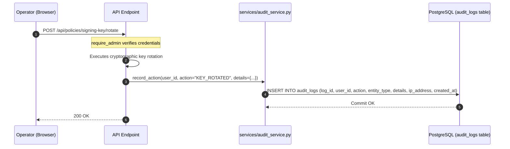
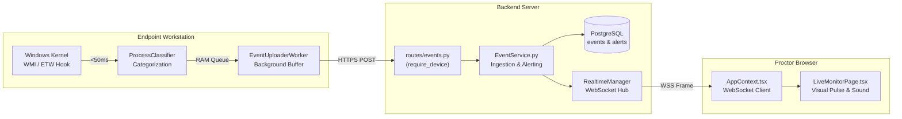

# 19. Logging, Telemetry & Administrative Audit Monitoring

---

## What Am I Looking At?

This document specifies the logging architecture, real-time telemetry pipelines, and administrative audit monitoring mechanisms across SPEMCS. It covers:
1. **Local Endpoint Agent Logging**: High-performance rolling file logging to `%ProgramData%\Spemcs\Logs`.
2. **Backend Application Logging**: Asynchronous structured logging in FastAPI.
3. **The Administrative Audit Trail**: Immutable relational persistence in the `audit_logs` table.
4. **Real-Time Telemetry Pipeline**: Low-latency event streaming from Windows kernel hooks to proctor monitors.

---

## Why Does It Exist?

In high-stakes academic testing:
- **Dispute Resolution**: When a student challenges a grade or penalty, the institution must provide an unalterable, minute-by-minute timeline proving that unauthorized software (e.g. AnyDesk) was running on the student's machine.
- **Troubleshooting Without Physical Access**: Lab technicians need rolling text logs to diagnose why a specific machine failed to apply a firewall rule or disconnected from the network.
- **Regulatory Accountability**: Every privileged administrative action (activating an exam, rotating a cryptographic key, resolving a cheating alert) must record *who* performed it, from *which IP address*, and *when*.

---

## 1. Endpoint Agent Logging Architecture

Located in [`Endpoint-agent/src/Spemcs.Agent.Service/FileLogging.cs`](file:///c:/Users/shrma/Desktop/spemcsnew/Endpoint-agent/src/Spemcs.Agent.Service/FileLogging.cs).

### Log Storage & Rotation Parameters
- **Directory**: `C:\ProgramData\Spemcs\Logs`
- **File Pattern**: `agent-{yyyyMMdd}.log`
- **Max File Size**: 10 MB per file (rolls over to `.1.log`, `.2.log`)
- **Retention Period**: 14 days of automatic retention; older logs are pruned during service startup.
- **Thread Safety**: Implements a dedicated non-blocking background queue (`BlockingCollection<LogEntry>`) to ensure file I/O never blocks the core WMI or firewall enforcement loops.

### Standard Log Entry Format
```text
[2026-09-06 02:05:14.812 +00:00] [INF] [EnforcementStateMachine] State transition: UNARMED -> ARMED (Policy: 18f921bb-442a-4467-8cfb-81014da40348, Version: 1)
[2026-09-06 02:05:14.890 +00:00] [INF] [WindowsFirewallAdapter] Setting DefaultOutboundAction to BLOCK across profiles: Domain, Private, Public
[2026-09-06 02:05:14.945 +00:00] [INF] [SqliteRollbackJournal] Recorded rule addition: SPEMCS-18f921bb-BrowserAllow (State: ACTIVE)
[2026-09-06 02:05:32.105 +00:00] [WRN] [ProcessClassifier] Prohibited process detected: AnyDesk.exe (PID: 5824, Category: RemoteDesktop)
[2026-09-06 02:05:32.140 +00:00] [INF] [EventUploaderWorker] Telemetry uploaded successfully (EventID: 7c154378-b58f-42fe-8a32-9d48316242fe)
```

---

## 2. Backend Logging Architecture

Configured in [`backend/backend/app/main.py`](file:///c:/Users/shrma/Desktop/spemcsnew/backend/backend/app/main.py).

- **Output Targets**: Standard output (stdout) for container/systemd capture + rolling file `logs/app.log`.
- **Log Level**: Controlled by `SPEMCS_LOG_LEVEL` (`INFO` in production, `DEBUG` in development).
- **Secret Masking Guarantee**: Handled by [`backend/backend/app/config.py`](file:///c:/Users/shrma/Desktop/spemcsnew/backend/backend/app/config.py). Exception messages and log outputs **never contain plaintext secret keys** or disclose character lengths.

---

## 3. The Immutable Administrative Audit Trail (`audit_logs`)

All privileged operations executed by human operators are automatically committed to the `audit_logs` table in PostgreSQL.



### Verified Audit Event Types:
- `LOGIN` / `LOGOUT`: Operator authentication events.
- `EXAM_CREATED` / `EXAM_ACTIVATED` / `EXAM_STOPPED`: Examination lifecycle changes.
- `KEY_ROTATED` / `KEY_REVOKED`: Cryptographic keyring mutations.
- `ALERT_RESOLVED`: Proctor resolution of a student cheating alert.
- `LAB_MODIFIED`: Computer lab capacity or status updates.

---

## 4. Real-Time Telemetry Pipeline



### Pipeline Performance Characteristics:
- **Detection Latency**: $< 50\text{ ms}$ from kernel process spawn to agent classification.
- **Upload Latency**: $< 200\text{ ms}$ over campus LAN to backend server.
- **WebSocket Broadcast Latency**: $< 25\text{ ms}$ to connected proctor browsers.
- **End-to-End Alert Time**: **Under 300 milliseconds total** from student click to proctor screen alert.
