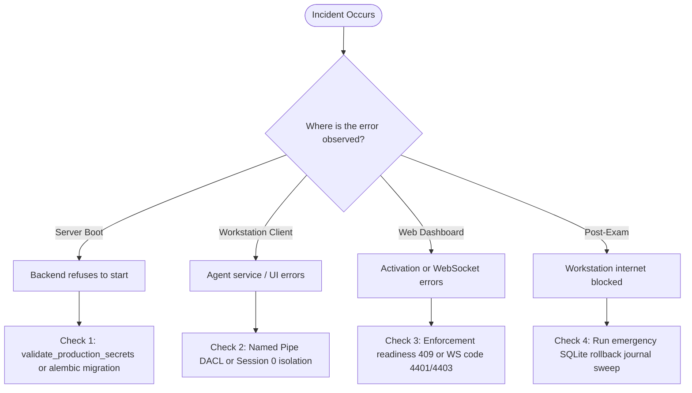

# 20. Troubleshooting & Diagnostic Runbook

---

## What Am I Looking At?

This document is the **practical incident resolution and diagnostic runbook** for SPEMCS. It provides lab administrators, proctors, and DevOps engineers with structured **Symptom $\rightarrow$ Cause $\rightarrow$ Verification $\rightarrow$ Remediation** tables for every verified failure mode in the system.

---

## Why Does It Exist?

During an examination, technical issues must be diagnosed and resolved in seconds, not hours. This guide eliminates guesswork by detailing the exact terminal commands, log patterns, and configuration settings required to restore normal operation.

---

## Diagnostic Triage Matrix



---

## 1. Backend Server Startup Failures

### Symptom: `RuntimeError: Configuration error: ... default or placeholder secret`
- **Cause**: `SPEMCS_ENV=production` is set, but `SECRET_KEY`, `DEVICE_TOKEN_SECRET`, or `ENROLLMENT_BOOTSTRAP_KEY` still contains committed default placeholders (`"dev-"` or `"change-in-production"`).
- **Verification**: Check `/etc/spemcs/backend.env` or inspect `journalctl -u spemcs-backend -n 20`.
- **Remediation**:
  Generate fresh 64-character random secrets and update `/etc/spemcs/backend.env`:
  ```bash
  openssl rand -hex 32
  sudo systemctl restart spemcs-backend
  ```

---

### Symptom: `SchemaVersionMismatchError: Database schema revision does not match code head`
- **Cause**: The application was updated, but database migrations were not applied.
- **Verification**: Run `alembic current` inside `/opt/spemcs/backend`.
- **Remediation**:
  Apply pending migrations:
  ```bash
  source .venv/bin/activate
  alembic upgrade head
  sudo systemctl restart spemcs-backend
  ```

---

## 2. Endpoint Agent & Workstation Failures

### Symptom: Workstation UI Fails to Connect to Named Pipe (`TimeoutException`)
- **Cause**: `Spemcs.Agent.Service` is stopped, crashed, or currently recycling its pipe listener in Session 0.
- **Verification**:
  Open Elevated PowerShell on the workstation:
  ```powershell
  Get-Service Spemcs.Agent.Service
  ```
- **Remediation**:
  1. If stopped: `Start-Service Spemcs.Agent.Service`.
  2. Inspect logs: `Get-Content C:\ProgramData\Spemcs\Logs\agent-*.log -Tail 50`.
  3. Verify pipe exists:
     ```powershell
     [System.IO.Directory]::GetFiles("\\.\pipe\") | Select-String "spemcs"
     ```

---

### Symptom: `401 Unauthorized` on `/api/v1/devices/register`
- **Cause**: The workstation's `EnrollmentBootstrapKey` in `appsettings.json` does not match `ENROLLMENT_BOOTSTRAP_KEY` configured on the backend server.
- **Verification**:
  Inspect backend log for: `Enrolment request rejected: missing or invalid bootstrap enrollment key`.
- **Remediation**:
  Update `EnrollmentBootstrapKey` in `C:\Program Files\Spemcs\Endpoint Agent\appsettings.json` and restart service:
  ```powershell
  Restart-Service Spemcs.Agent.Service
  ```

---

### Symptom: Process Classifier Crashes with `InvalidOperationException` (WMI Handle Leak)
- **Cause**: Rapid process creation exhausted COM event listener handles.
- **Verification**: Inspect agent log for: `System.Management.ManagementException: Quota violation`.
- **Remediation**:
  The agent automatically recycles the watcher. If persistent, restart the service or verify that the ETW fallback listener is enabled in `appsettings.json`.

---

## 3. Exam Activation & Proctor Dashboard Failures

### Symptom: Activating Exam Returns `HTTP 409 Conflict` in ExamShield
- **Cause**: Server-side enforcement readiness check failed because one or more assigned lab workstations are offline, missing a policy, or have `rules_installed == 0`.
- **Verification**: Inspect response JSON modal in ExamShield.
- **Remediation**:
  1. Review the `unarmed_devices` list returned in the 409 response.
  2. Power on the offending physical lab PCs.
  3. Click "Compile & Distribute Policy" to re-arm the fleet before clicking "Activate Exam".

---

### Symptom: Dashboard WebSocket Disconnects with Code `4401` or `4403`
- **Cause**:
  - Code `4401`: The operator's JWT expired or was signed with a different `SECRET_KEY`.
  - Code `4403`: The authenticated user lacks the required `admin` or `proctor` role (e.g., student account used).
- **Verification**: Check browser developer tools Console / Network tab for WebSocket close frames.
- **Remediation**:
  Log out and re-authenticate via `/login` to acquire a fresh operator token.

---

## 4. Post-Exam Emergency Rollback

### Symptom: Lab PC Has No Internet After Exam Concludes (Firewall Locked)
- **Cause**: Workstation suffered a sudden power cut mid-exam, or network disconnected before deactivation command arrived.
- **Verification**:
  Open Elevated PowerShell and run `netsh advfirewall show allprofiles`. If `DefaultOutboundAction` reports `Block`, enforcement is still active.
- **Remediation (Automated Emergency Rollback Script)**:
  Run the recovery script located in [`Endpoint-agent/scripts/uninstall_service.ps1`](file:///c:/Users/shrma/Desktop/spemcsnew/Endpoint-agent/scripts/uninstall_service.ps1):
  ```powershell
  # Emergency Firewall Reset Script
  Import-Module NetSecurity
  
  # 1. Purge all SPEMCS-created rules
  Get-NetFirewallRule -Name "SPEMCS-*" | Remove-NetFirewallRule -Verbose
  
  # 2. Reset Default Outbound to ALLOW
  Set-NetFirewallProfile -Profile Domain,Private,Public -DefaultOutboundAction Allow
  
  # 3. Clean DoH Registry Suppression
  Remove-ItemProperty -Path "HKLM:\SOFTWARE\Policies\Google\Chrome" -Name "DnsOverHttpsMode" -ErrorAction SilentlyContinue
  Remove-ItemProperty -Path "HKLM:\SOFTWARE\Policies\Microsoft\Edge" -Name "DnsOverHttpsMode" -ErrorAction SilentlyContinue
  
  Write-Host "Workstation restored to baseline successfully." -ForegroundColor Green
  ```
