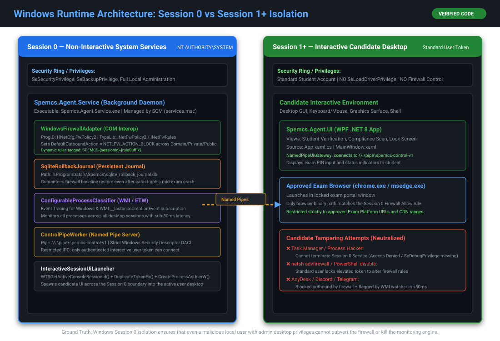

# 23. Visual Glossary of Systems & Security Concepts

---

## What Am I Looking At?

This document is the **illustrated glossary** for difficult systems, operating system, and cryptographic concepts used throughout SPEMCS. Every entry follows a strict four-part schema:
- **Simple Meaning**: 1–2 sentence plain English explanation.
- **Why SPEMCS Needs It**: The concrete problem it solves in this project.
- **Where It Appears**: Exact source files, classes, and lines of code.
- **Diagram / Reference**: Visual architectural diagram or reference.

---

## 1. Session 0 Isolation

### Simple Meaning
A Windows security feature where all system services run in a completely isolated, non-interactive desktop session (`Session 0`), preventing them from touching user windows or receiving user keyboard/mouse clicks.

### Why SPEMCS Needs It
If the SPEMCS agent ran in the student's desktop session (`Session 1`), a clever student could open Task Manager, inject a DLL, attach a debugger, or kill the process. Running in Session 0 under `NT AUTHORITY\SYSTEM` makes the service immune to unprivileged user tampering.

### Where It Appears
- Source: [`Endpoint-agent/src/Spemcs.Agent.Service/Program.cs`](file:///c:/Users/shrma/Desktop/spemcsnew/Endpoint-agent/src/Spemcs.Agent.Service/Program.cs)
- Source: [`Endpoint-agent/src/Spemcs.Agent.Service/InteractiveSessionUiLauncher.cs`](file:///c:/Users/shrma/Desktop/spemcsnew/Endpoint-agent/src/Spemcs.Agent.Service/InteractiveSessionUiLauncher.cs)

### Diagram / Reference


---

## 2. Windows Named Pipes (`\\.\pipe\spemcs-control-v1`)

### Simple Meaning
A secure inter-process communication (IPC) channel in Windows that acts like an in-memory network cable connecting two separate applications on the same computer.

### Why SPEMCS Needs It
Because the service lives in Session 0 and the candidate UI lives in Session 1+, they cannot share memory. The Named Pipe allows the UI to pass the student's roll number to the service, and allows the service to report lockdown status back to the UI, protected by Windows Security Descriptors (DACL).

### Where It Appears
- Source: [`Endpoint-agent/src/Spemcs.Agent.Service/ControlPipeWorker.cs`](file:///c:/Users/shrma/Desktop/spemcsnew/Endpoint-agent/src/Spemcs.Agent.Service/ControlPipeWorker.cs)
- Source: [`Endpoint-agent/src/Spemcs.Agent.Ipc/NamedPipeServer.cs`](file:///c:/Users/shrma/Desktop/spemcsnew/Endpoint-agent/src/Spemcs.Agent.Ipc/NamedPipeServer.cs)

```
[ Session 1+: Candidate UI ] ◄─── Named Pipe Stream ───► [ Session 0: SYSTEM Service ]
```

---

## 3. COM Interop & `HNetCfg.FwPolicy2`

### Simple Meaning
Component Object Model (COM) is a legacy Windows binary standard that allows .NET languages like C# to directly command native operating system C++ components without needing command-line tools.

### Why SPEMCS Needs It
Running command-line utilities like `netsh advfirewall` or PowerShell `New-NetFirewallRule` is slow (taking hundreds of milliseconds per command) and leaves observable console windows. `HNetCfg.FwPolicy2` manipulates the Windows Filtering Platform kernel tables directly in microseconds.

### Where It Appears
- Source: [`Endpoint-agent/src/Spemcs.Agent.Core/Network/WindowsFirewallAdapter.cs`](file:///c:/Users/shrma/Desktop/spemcsnew/Endpoint-agent/src/Spemcs.Agent.Core/Network/WindowsFirewallAdapter.cs)

---

## 4. Windows Management Instrumentation (WMI)

### Simple Meaning
An operating system event system that allows software to subscribe to changes on a Windows computer, such as querying hardware, monitoring disk space, or tracking when a program starts.

### Why SPEMCS Needs It
SPEMCS subscribes to `__InstanceCreationEvent` on the `Win32_Process` class to catch whenever a candidate launches a program (e.g. AnyDesk) in under 50 milliseconds.

### Where It Appears
- Source: [`Endpoint-agent/src/Spemcs.Agent.Core/ProcessServices.cs`](file:///c:/Users/shrma/Desktop/spemcsnew/Endpoint-agent/src/Spemcs.Agent.Core/ProcessServices.cs)

---

## 5. Event Tracing for Windows (ETW)

### Simple Meaning
A high-performance, ultra-low-overhead kernel tracing mechanism built into Windows that logs operating system events at the driver level.

### Why SPEMCS Needs It
Acts as a dual-redundant, high-speed backup to WMI. SPEMCS listens to `Microsoft-Windows-DNS-Client` ETW providers to observe exactly which domain names are being resolved by which process IDs.

### Where It Appears
- Source: [`Endpoint-agent/src/Spemcs.Agent.Core/EtwDnsListener.cs`](file:///c:/Users/shrma/Desktop/spemcsnew/Endpoint-agent/src/Spemcs.Agent.Core/EtwDnsListener.cs)

---

## 6. DNS over HTTPS (DoH) Suppression

### Simple Meaning
A browser feature that encrypts DNS lookups and sends them over HTTPS directly to Cloudflare or Google, bypassing local network DNS servers.

### Why SPEMCS Needs It
If DoH is active, Chrome or Edge can resolve external cheating websites even when the campus network firewall attempts to block them. Writing enterprise policies to `HKLM\SOFTWARE\Policies` turns DoH off and forces all resolution through the monitored Windows stub resolver.

### Where It Appears
- Source: [`Endpoint-agent/src/Spemcs.Agent.Core/Network/WindowsFirewallAdapter.cs`](file:///c:/Users/shrma/Desktop/spemcsnew/Endpoint-agent/src/Spemcs.Agent.Core/Network/WindowsFirewallAdapter.cs)

---

## 7. RSA-PSS (Probabilistic Signature Scheme)

### Simple Meaning
A modern, mathematically proven standard for digital signatures that adds randomized "salt" to the signature calculation so that signing the same message twice produces different, unforgeable byte signatures.

### Why SPEMCS Needs It
Older signature padding schemes (like PKCS#1 v1.5) are vulnerable to Bleichenbacher padding oracle attacks. RSA-PSS guarantees that exam network policies compiled on the server cannot be forged, manipulated, or altered by anyone on the network.

### Where It Appears
- Source: [`backend/backend/services/policy_signer.py`](file:///c:/Users/shrma/Desktop/spemcsnew/backend/backend/services/policy_signer.py)
- Source: [`Endpoint-agent/src/Spemcs.Agent.Core/Network/PolicyReceiver.cs`](file:///c:/Users/shrma/Desktop/spemcsnew/Endpoint-agent/src/Spemcs.Agent.Core/Network/PolicyReceiver.cs)

---

## 8. Canonical JSON (RFC 8785)

### Simple Meaning
A strict rulebook for serializing JSON data so that keys are always in alphabetical order, whitespace is eliminated, numbers are formatted identically, and two different programming languages produce the exact same sequence of bytes.

### Why SPEMCS Needs It
Python and C# format JSON slightly differently (e.g. `{"a": 1}` vs `{"a":1}`). If the bytes differ by even a single space, the RSA digital signature check will fail. RFC 8785 ensures bitwise identical serialization across Python and C#.

### Where It Appears
- Source: [`backend/backend/services/policy_signer.py`](file:///c:/Users/shrma/Desktop/spemcsnew/backend/backend/services/policy_signer.py)

---

## 9. Hardware-Bound Device Tokens

### Simple Meaning
An authentication token that embeds the unique motherboard or BIOS UUID of a physical computer into an encrypted HMAC signature.

### Why SPEMCS Needs It
Prevents workstation impersonation. If student machine A steals an authentication token, it cannot use that token to impersonate student machine B, because the server verifies the token against the sender's physical hardware UUID.

### Where It Appears
- Source: [`backend/backend/app/dependencies.py`](file:///c:/Users/shrma/Desktop/spemcsnew/backend/backend/app/dependencies.py) (`assert_device_owns`)

---

## 10. SQLite Rollback Journal

### Simple Meaning
A lightweight, ACID-compliant local database that records every single firewall rule and baseline profile state *before* it is applied to the operating system.

### Why SPEMCS Needs It
If a computer lab suffers a sudden power cut or kernel crash mid-exam, the machine reboots with internet access disabled. On startup, the service reads the SQLite rollback journal and cleanly sweeps away all exam rules, restoring normal campus internet.

### Where It Appears
- Source: [`Endpoint-agent/src/Spemcs.Agent.Core/Network/SqliteRollbackJournal.cs`](file:///c:/Users/shrma/Desktop/spemcsnew/Endpoint-agent/src/Spemcs.Agent.Core/Network/SqliteRollbackJournal.cs)

---

## 11. Enforcement State Machine

### Simple Meaning
A software controller that enforces strict rules about what state the agent can transition to, such as moving from `UNARMED` to `ARMED`, `ENFORCED`, and `ROLLING_BACK`.

### Why SPEMCS Needs It
Prevents illegal operational states, such as attempting to tear down a firewall session that was never created, or attempting to lock down a workstation without a cryptographically verified policy.

### Where It Appears
- Source: [`Endpoint-agent/src/Spemcs.Agent.Core/Network/EnforcementStateMachine.cs`](file:///c:/Users/shrma/Desktop/spemcsnew/Endpoint-agent/src/Spemcs.Agent.Core/Network/EnforcementStateMachine.cs)

---

## 12. Protocol 41 (6in4 Tunneling)

### Simple Meaning
An internet protocol that packages IPv6 traffic inside IPv4 packets to tunnel traffic past older firewalls.

### Why SPEMCS Needs It
Cheating tools can use 6in4 tunnels to exfiltrate data past IPv4-only firewall rules. SPEMCS explicitly blocks Protocol 41 on the Windows Filtering Platform.

### Where It Appears
- Source: [`Endpoint-agent/src/Spemcs.Agent.Core/Network/WindowsFirewallAdapter.cs`](file:///c:/Users/shrma/Desktop/spemcsnew/Endpoint-agent/src/Spemcs.Agent.Core/Network/WindowsFirewallAdapter.cs)

---

## 13. Timing-Safe String Comparison (`hmac.compare_digest`)

### Simple Meaning
A comparison function that always takes the exact same amount of CPU clock cycles to execute, regardless of whether two strings match or differ at the very first character.

### Why SPEMCS Needs It
Standard `==` string comparisons stop checking as soon as they find a mismatch. An attacker can measure response times down to nanoseconds to deduce the password character by character. `hmac.compare_digest` eliminates this vulnerability.

### Where It Appears
- Source: [`backend/backend/app/dependencies.py`](file:///c:/Users/shrma/Desktop/spemcsnew/backend/backend/app/dependencies.py#L189)
