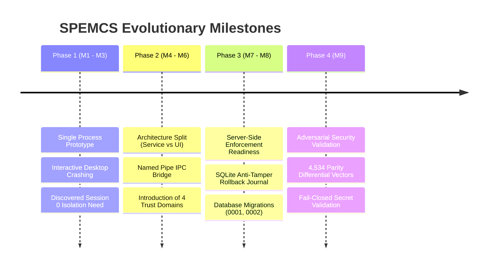

# 24. Architectural Change Audit & Milestone Evolution

---

## What Am I Looking At?

This document is the **architectural change audit** of SPEMCS. It tracks how the system evolved from early proof-of-concept prototypes into an enterprise-grade endpoint monitoring platform across development milestones **M1 through M9**.

---

## Why Does It Exist?

Codebases accumulate architectural shifts that can confuse future maintainers:
- Why are there two separate Named Pipes (`spemcs-control-v1` and `spemcs-agent-v1`)?
- Why was the agent split into a service and a UI?
- Why is `alerts.exam_id` nullable when it points to `exams`?
This audit documents the rationale, architectural drivers, and codebase transformations for each major evolutionary milestone.

---

## The Four Major Evolutionary Phases

---

## 1. Phase 1 (M1–M3): Single-Process Prototype $\rightarrow$ Privilege Isolation
- **Initial Implementation**: The agent was initially designed as a single monolithic Windows desktop application that students launched directly.
- **Critical Flaw Discovered**: Running with standard student privileges meant the agent could not modify Windows Firewall without UAC elevation prompts, and students could terminate the process via Task Manager or Process Hacker.
- **Architectural Shift**: Split into a Windows Service running under `NT AUTHORITY\SYSTEM` in **Session 0** and a separate WPF UI running in **Session 1+**. Created [`InteractiveSessionUiLauncher.cs`](file:///c:/Users/shrma/Desktop/spemcsnew/Endpoint-agent/src/Spemcs.Agent.Service/InteractiveSessionUiLauncher.cs) to cross the session boundary.

---

## 2. Phase 2 (M4–M6): Shared Secrets $\rightarrow$ 4 Cryptographic Trust Domains
- **Initial Implementation**: Early prototypes used standard operator JWTs for all operations, including agent heartbeats and device registration.
- **Critical Flaw Discovered**: Token confusion attack: extracting a token from an endpoint allowed an attacker to call administrative endpoints.
- **Architectural Shift**: Formal separation into four isolated trust domains:
  1. Human Operator JWTs (`SECRET_KEY`, HS256).
  2. Machine Device Tokens (`DEVICE_TOKEN_SECRET`, HMAC-SHA256).
  3. Pre-Shared Bootstrap Keys (`ENROLLMENT_BOOTSTRAP_KEY`, `hmac.compare_digest`).
  4. Cryptographic Keyring (`SIGNING_KEY_DIR`, RSA-2048, RSA-PSS).

---

## 3. Phase 3 (M7–M8): Premature Activation $\rightarrow$ Server-Side Readiness Gating
- **Initial Implementation**: Clicking "Activate Exam" immediately set the exam status to `ACTIVE` regardless of whether endpoints had downloaded the policy.
- **Critical Flaw Discovered**: Network race condition: exams activated before lab PCs armed their firewalls, creating windows of open internet access.
- **Architectural Shift**:
  - Implemented [`backend/backend/services/enforcement_readiness.py`](file:///c:/Users/shrma/Desktop/spemcsnew/backend/backend/services/enforcement_readiness.py).
  - Added `device_policy_states` table to track policy application per workstation.
  - Activation now strictly returns **HTTP 409 Conflict** if any assigned device is unarmed.
  - Resolved `alerts.exam_id` nullability to prevent dropping background lab security events.

---

## 4. Phase 4 (M9): Adversarial Validation & Differential Parity
- **Initial Implementation**: Python and C# implemented separate IP address validation logic without formal differential testing.
- **Critical Flaw Discovered**: Address parsing drift: subnets accepted by the backend policy compiler could be rejected by the agent validator, causing activation failure.
- **Architectural Shift**:
  - Built the cross-language parity harness ([`verify_policy_destination_validator_parity.py`](file:///c:/Users/shrma/Desktop/spemcsnew/Endpoint-agent/tests/parity/verify_policy_destination_validator_parity.py)) with 4,534 differential test vectors.
  - Implemented [`validate_production_secrets()`](file:///c:/Users/shrma/Desktop/spemcsnew/backend/backend/app/config.py#L180) to prevent servers from booting on default development credentials.
