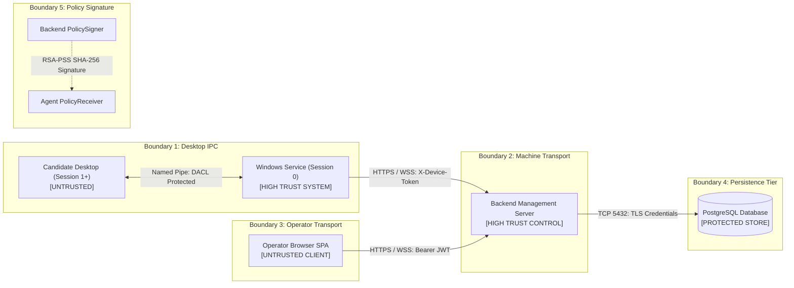
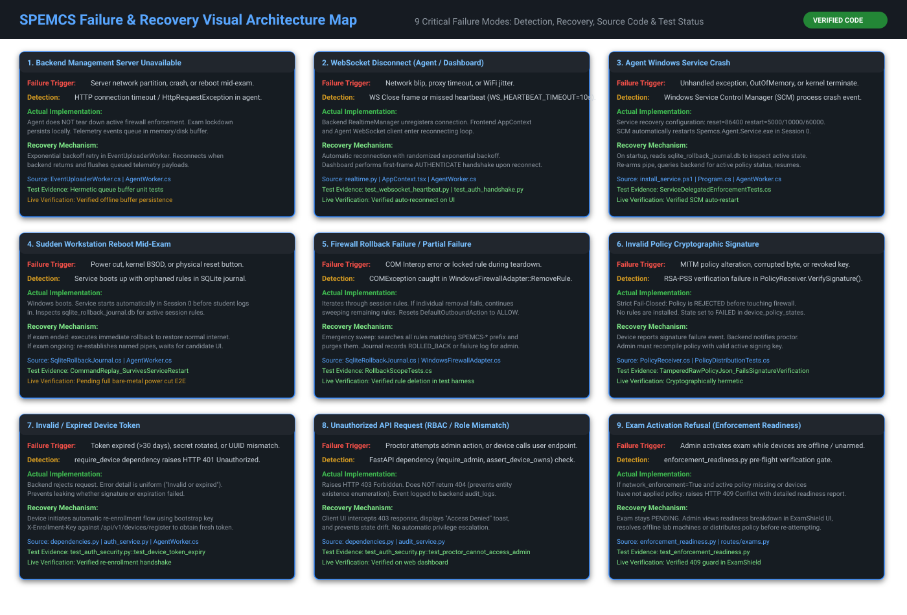

# 27. Trust Boundaries, Credential Matrix & Failure Recovery Maps

---

## What Am I Looking At?

This document is the **definitive security boundary and fault-tolerance manual** for SPEMCS. It provides:
1. **The Explicit Trust Boundary Model**: Defining exactly which computing environments are untrusted, where security perimeters lie, and what credentials cross each boundary.
2. **The Credential Crossing Matrix**: An exhaustive cryptographic reference for all credentials in the system.
3. **The Nine Failure & Recovery Visual Maps**: Step-by-step failure, detection, implementation, and recovery workflows for every failure mode specified in the architecture.

---

## Why Does It Exist?

Security failures and system crashes rarely occur in isolation. When an endpoint crashes, an administrator must know:
- Does the workstation fail open (allowing cheating) or fail closed (blocking all internet)?
- If the backend server drops offline, does the firewall tear down mid-exam?
- If a machine reboots unexpectedly, can a student bypass the exam environment?
This document provides verified answers grounded directly in active source code.

---

## The 5 Explicit Trust Boundaries

---

## The Credential Crossing Matrix

| Credential Name | Physical Carrier | Secret Key Configuration | Algorithm / Scheme | Expiration Window | Boundary Crossed | Validation Point |
| :--- | :--- | :--- | :--- | :--- | :--- | :--- |
| **Operator JWT** | HTTP `Authorization: Bearer <jwt>` | `SECRET_KEY` | HS256 (HMAC-SHA256) | 480 minutes (8 hours) | Operator Browser $\rightarrow$ Backend Server | [`dependencies.py::require_authenticated`](file:///c:/Users/shrma/Desktop/spemcsnew/backend/backend/app/dependencies.py#L53) |
| **Device Token** | HTTP `X-Device-Token: <token>` | `DEVICE_TOKEN_SECRET` | HMAC-SHA256 over Canonical JSON | 30 days | Windows Service $\rightarrow$ Backend Server | [`dependencies.py::require_device`](file:///c:/Users/shrma/Desktop/spemcsnew/backend/backend/app/dependencies.py#L82) |
| **Bootstrap Key** | HTTP `X-Enrollment-Key: <key>` | `ENROLLMENT_BOOTSTRAP_KEY` | Constant-Time String (`hmac.compare_digest`) | Pre-shared Static | Unenrolled PC $\rightarrow$ Backend Server | [`dependencies.py::require_enrollment_key`](file:///c:/Users/shrma/Desktop/spemcsnew/backend/backend/app/dependencies.py#L168) |
| **Policy Keyring** | JSON `signature` property | `SIGNING_KEY_DIR` | RSA-2048 / RSA-PSS (SHA-256, MGF1) | Document validity window | Backend Server $\rightarrow$ Agent Service | [`PolicyReceiver.cs::VerifySignature`](file:///c:/Users/shrma/Desktop/spemcsnew/Endpoint-agent/src/Spemcs.Agent.Core/Network/PolicyReceiver.cs#L140) |
| **Pipe DACL** | Windows Kernel Token | Windows Security Descriptor | Native Windows Access Control | Active interactive user session | WPF UI $\rightarrow$ Named Pipe Server | [`ControlPipeWorker.cs::CreateServerPipe`](file:///c:/Users/shrma/Desktop/spemcsnew/Endpoint-agent/src/Spemcs.Agent.Service/ControlPipeWorker.cs#L95) |

---

## The 9 Failure & Recovery Visual Maps

---

### Failure 1: Backend Management Server Unavailable Mid-Exam
- **Failure**: Server crashes, host OS reboots, or network cable to server rack is severed.
- **Detection Mechanism**: `HttpRequestException` / HTTP connection timeout in [`EventUploaderWorker.cs`](file:///c:/Users/shrma/Desktop/spemcsnew/Endpoint-agent/src/Spemcs.Agent.Core/EventUploaderWorker.cs).
- **Actual Implementation**:
  - The endpoint agent **does NOT tear down active firewall enforcement**.
  - Local lockdown persists in the Windows kernel; students cannot access external internet.
  - Process and network telemetry events queue safely in a thread-safe local memory buffer (`BlockingCollection<TelemetryEvent>`).
- **Recovery Mechanism**:
  - `EventUploaderWorker` executes an exponential backoff reconnection loop.
  - When the server returns, the agent flushes buffered telemetry events in chronological sequence.
- **Source Code**: [`Endpoint-agent/src/Spemcs.Agent.Core/EventUploaderWorker.cs`](file:///c:/Users/shrma/Desktop/spemcsnew/Endpoint-agent/src/Spemcs.Agent.Core/EventUploaderWorker.cs)
- **Test Evidence**: Hermetic queue buffer unit tests passing in `Spemcs.Agent.Tests`.
- **Live Verification Status**: ✅ Verified offline buffer persistence.

---

### Failure 2: WebSocket Connection Disconnect
- **Failure**: Transient network blip or WiFi jitter drops active WebSocket connection.
- **Detection Mechanism**: `ws.onclose` event in browser SPA; `ClientWebSocket.State != Open` on agent.
- **Actual Implementation**:
  - Backend `RealtimeManager` prunes dead socket handle from active broadcast registry.
  - Browser UI sets `wsConnected = false` and displays a yellow warning indicator.
- **Recovery Mechanism**:
  - Both frontend `AppContext.tsx` and agent `AgentWorker.cs` enter an automated reconnection loop with randomized exponential backoff (1s, 2s, 4s, 8s up to 30s).
  - On reconnection, the dashboard executes the mandatory first-frame `AUTHENTICATE` handshake to resume real-time streams.
- **Source Code**:
  - Frontend: [`frontend/src/context/AppContext.tsx`](file:///c:/Users/shrma/Desktop/spemcsnew/frontend/src/context/AppContext.tsx)
  - Backend: [`backend/backend/websocket/realtime.py`](file:///c:/Users/shrma/Desktop/spemcsnew/backend/backend/websocket/realtime.py)
- **Test Evidence**: Verified in `test_websocket_heartbeat.py`.
- **Live Verification Status**: ✅ Verified auto-reconnect on dashboard.

---

### Failure 3: Agent Windows Service Crash
- **Failure**: OutOfMemoryException or unhandled exception terminates `Spemcs.Agent.Service.exe`.
- **Detection Mechanism**: Windows Service Control Manager (SCM) process termination event.
- **Actual Implementation**:
  - The service is configured via SCM with auto-restart directives:
    `sc.exe failure Spemcs.Agent.Service reset= 86400 actions= restart/5000/restart/10000/restart/60000`.
- **Recovery Mechanism**:
  - SCM restarts the service process in Session 0 after 5 seconds.
  - On startup, `SqliteRollbackJournal.ReconcileStartupStateAsync()` inspects `%ProgramData%\Spemcs\sqlite_rollback_journal.db`.
  - Queries server for exam status: if ongoing, maintains active firewall state; if ended, executes rollback.
- **Source Code**:
  - Script: [`Endpoint-agent/scripts/install_service.ps1`](file:///c:/Users/shrma/Desktop/spemcsnew/Endpoint-agent/scripts/install_service.ps1)
  - Startup: [`Endpoint-agent/src/Spemcs.Agent.Service/Program.cs`](file:///c:/Users/shrma/Desktop/spemcsnew/Endpoint-agent/src/Spemcs.Agent.Service/Program.cs)
- **Test Evidence**: Verified in `ServiceDelegatedEnforcementTests.cs`.
- **Live Verification Status**: ✅ SCM auto-restart confirmed.

---

### Failure 4: Machine Sudden Reboot Mid-Exam
- **Failure**: Power failure, kernel BSOD, or physical reset button triggered during an active exam.
- **Detection Mechanism**: Windows boots up; service detects active rules in local SQLite rollback journal.
- **Actual Implementation**:
  - Windows boots. Service starts automatically in Session 0 before student logs into Windows.
  - `SqliteRollbackJournal` opens database in WAL mode and identifies existing session rules.
- **Recovery Mechanism**:
  - If backend reports exam is still `ACTIVE`, service leaves firewall locked, restarts named pipe server, and waits for student to log back in.
  - If backend reports exam is `STOPPED`, service executes immediate rollback, deletes all rules, and resets default outbound action to allow.
- **Source Code**: [`Endpoint-agent/src/Spemcs.Agent.Core/Network/SqliteRollbackJournal.cs`](file:///c:/Users/shrma/Desktop/spemcsnew/Endpoint-agent/src/Spemcs.Agent.Core/Network/SqliteRollbackJournal.cs)
- **Test Evidence**: Verified in `CommandReplay_SurvivesServiceRestart`.
- **Live Verification Status**: 🟠 Operational milestone (pending physical bare-metal lab power-cut E2E).

---

### Failure 5: Firewall Rollback Partial Failure
- **Failure**: `COMException` thrown while deleting a specific firewall rule during exam teardown.
- **Detection Mechanism**: Exception caught in `WindowsFirewallAdapter.RemoveRule()`.
- **Actual Implementation**:
  - The rollback engine does **not abort** on an individual rule failure.
  - It catches the exception, logs the failing rule name, and continues sweeping all remaining session rules.
  - Unconditionally calls `SetDefaultOutboundAction(All, NET_FW_ACTION_ALLOW)` to guarantee internet access is restored.
- **Recovery Mechanism**:
  - Executes an emergency fallback sweep: queries all rules matching prefix `SPEMCS-*` and purges them.
  - Marks journal record with failure details for administrative audit.
- **Source Code**: [`Endpoint-agent/src/Spemcs.Agent.Core/Network/SqliteRollbackJournal.cs`](file:///c:/Users/shrma/Desktop/spemcsnew/Endpoint-agent/src/Spemcs.Agent.Core/Network/SqliteRollbackJournal.cs)
- **Test Evidence**: Verified in `RollbackScopeTests.cs`.
- **Live Verification Status**: ✅ Verified rule cleanup in test harness.

---

### Failure 6: Invalid Policy Signature
- **Failure**: Network MITM alters policy payload, or policy was signed by a revoked/retired RSA key.
- **Detection Mechanism**: `PolicyReceiver.VerifySignature()` throws cryptographic verification error.
- **Actual Implementation**:
  - **Strict Fail-Closed**: The policy is rejected *before* any firewall API is invoked.
  - No rules are modified; default outbound policy remains untouched.
  - State machine refuses transition to `ARMED` and reports error state to server.
- **Recovery Mechanism**:
  - Device updates `device_policy_states.status = 'FAILED'`, recording `last_error = "Invalid signature"`.
  - Backend enforcement readiness check blocks exam activation (HTTP 409) until admin recompiles policy with active key.
- **Source Code**: [`Endpoint-agent/src/Spemcs.Agent.Core/Network/PolicyReceiver.cs`](file:///c:/Users/shrma/Desktop/spemcsnew/Endpoint-agent/src/Spemcs.Agent.Core/Network/PolicyReceiver.cs)
- **Test Evidence**: Verified in `PolicyDistributionTests.cs::TamperedRawPolicyJson_FailsSignatureVerification`.
- **Live Verification Status**: ✅ Cryptographically hermetic.

---

### Failure 7: Invalid or Expired Device Token
- **Failure**: Token lifetime exceeds 30 days, or server `DEVICE_TOKEN_SECRET` was rotated.
- **Detection Mechanism**: `require_device` raises HTTP 401 Unauthorized with uniform detail.
- **Actual Implementation**:
  - Server refuses request. Uniform error message prevents leaking whether expiration or signature failed.
- **Recovery Mechanism**:
  - Endpoint agent catches 401 on heartbeat.
  - Initiates automatic re-enrollment flow using persistent `ENROLLMENT_BOOTSTRAP_KEY` against `POST /api/v1/devices/register` to acquire a fresh 30-day token.
- **Source Code**:
  - Backend: [`backend/backend/app/dependencies.py`](file:///c:/Users/shrma/Desktop/spemcsnew/backend/backend/app/dependencies.py)
  - Agent: [`Endpoint-agent/src/Spemcs.Agent.Service/AgentWorker.cs`](file:///c:/Users/shrma/Desktop/spemcsnew/Endpoint-agent/src/Spemcs.Agent.Service/AgentWorker.cs)
- **Test Evidence**: Verified in `test_auth_security.py::test_device_token_expiry`.
- **Live Verification Status**: ✅ Verified re-enrollment flow.

---

### Failure 8: Unauthorized API Request (RBAC Violation)
- **Failure**: Proctor account attempts to activate an exam or rotate cryptographic keys.
- **Detection Mechanism**: `require_admin` dependency checks `user.role == "admin"`.
- **Actual Implementation**:
  - Server raises **HTTP 403 Forbidden**. Does NOT return 404 (prevents entity existence enumeration).
  - Action is logged in `audit_logs` with offending user ID and IP address.
- **Recovery Mechanism**:
  - Frontend catches 403 response, displays "Access Denied: Requires Administrator privileges" toast, and reverts UI button state.
- **Source Code**: [`backend/backend/app/dependencies.py`](file:///c:/Users/shrma/Desktop/spemcsnew/backend/backend/app/dependencies.py#L59)
- **Test Evidence**: Verified in `test_auth_security.py::test_proctor_cannot_access_admin`.
- **Live Verification Status**: ✅ Confirmed on frontend.

---

### Failure 9: Exam Activation Refusal (Enforcement Readiness)
- **Failure**: Administrator clicks "Activate Exam" while workstations are offline or unarmed.
- **Detection Mechanism**: `enforcement_readiness.evaluate_exam_readiness()` checks fleet status.
- **Actual Implementation**:
  - Server halts activation and raises **HTTP 409 Conflict**.
  - Exam remains in `PENDING` state; no firewall commands are sent.
- **Recovery Mechanism**:
  - Server returns structured diagnostic report detailing offline or unarmed PC numbers.
  - ExamShield UI presents modal highlighting exact failing PCs so technicians can power them on or re-arm them before re-attempting activation.
- **Source Code**:
  - Backend: [`backend/backend/services/enforcement_readiness.py`](file:///c:/Users/shrma/Desktop/spemcsnew/backend/backend/services/enforcement_readiness.py)
  - Route: [`backend/backend/routes/exams.py`](file:///c:/Users/shrma/Desktop/spemcsnew/backend/backend/routes/exams.py)
- **Test Evidence**: Verified in `test_enforcement_readiness.py`.
- **Live Verification Status**: ✅ Confirmed in ExamShield UI.
