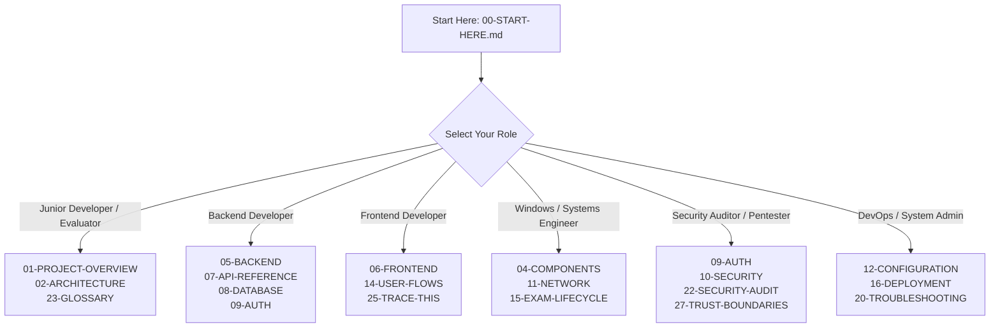

# SPEMCS Technical Master Documentation & Visual Textbook

Welcome to the **Complete Visual + Technical Master Documentation** for **SPEMCS** (**Secure Proctoring & Endpoint Monitoring Control System**).

This documentation suite is organized as an **illustrated engineering textbook**, designed to take any reader—from a student or junior engineer with zero prior knowledge to an institutional security auditor or future maintainer—to full architectural mastery of the entire distributed platform.

---

> 🏆 **Looking for everything in one single document?**  
> Check out the [**SPEMCS Holy Grail Master Document**](HOLY-GRAIL.md) — a unified, monolithic compendium combining all 28 chapters, visual diagrams, code mappings, API references, data dictionaries, and failure recovery maps into one authoritative reference manual.

---

## 📚 Master Volume Index (28 Chapters)

The documentation is organized into 6 thematic parts across 28 comprehensive volumes:

### Part I: Foundations & System Landscape
* [**00. START HERE: Zero-Knowledge Introduction to SPEMCS**](00-START-HERE.md)  
  *Zero-knowledge primer, 5-minute core concept, verified repository ground truth, and tailored reading paths.*
* [**01. Project Overview & Institutional Threat Model**](01-PROJECT-OVERVIEW.md)  
  *Real-world university lab problem space, threat actors, attack vectors, defense-in-depth model, and tech stack matrix.*
* [**02. High-Level Architecture & The 7 Architectural Views**](02-ARCHITECTURE.md)  
  *Logical, physical, runtime, deployment, network, application, and data views of SPEMCS.*
* [**03. Complete Codebase Map & Directory Guide**](03-COMPLETE-CODEBASE-MAP.md)  
  *Annotated repository tree, directory breakdown, and critical file catalog across backend, agent, and frontend.*
* [**04. Components Encyclopedia (3-Layer Deep Dive)**](04-COMPONENTS.md)  
  *Beginner analogy, system placement, and exact code mapping for 12 primary system components.*

---

### Part II: Subsystem Architecture & Internals
* [**05. Backend Architecture & FastAPI Internals**](05-BACKEND.md)  
  *FastAPI lifespan, dependency injection, 4 trust domains, router decomposition, and WebSocket hubs.*
* [**06. Frontend Architecture & React 18 / Vite SPA**](06-FRONTEND.md)  
  *Component hierarchy, `AppContext` state management, route guards, and 9 primary views.*
* [**07. Complete API Reference (86 Endpoints)**](07-API-REFERENCE.md)  
  *Exhaustive catalog of 84 HTTP operations + 2 WebSocket routes with auth schemes and request/response payloads.*
* [**08. Database Architecture & Relational Data Dictionary**](08-DATABASE.md)  
  *PostgreSQL schema for 14 tables, SQLite rollback journal, Alembic migrations, and ERD.*
* [**09. Authentication, Authorization & Cryptography**](09-AUTHENTICATION-AUTHORIZATION.md)  
  *4 cryptographic trust domains, RSA-PSS signature verification (RFC 8785), and tenant isolation.*
* [**10. Security Analysis & Threat Model**](10-SECURITY.md)  
  *STRIDE threat modeling, verified vulnerability findings (P0–P3), and cryptographic defense mitigations.*
* [**11. Network Architecture, Windows Firewall & DNS Enforcement**](11-NETWORK-AND-INFRASTRUCTURE.md)  
  *`HNetCfg.FwPolicy2` COM interop, profile 7 default block, DoH registry suppression, and fail-safe recovery.*

---

### Part III: Operational Mechanics & Lifecycles
* [**12. Configuration Reference & Environment Variables**](12-CONFIGURATION.md)  
  *Complete environment variable reference, `appsettings.json`, and secret rotation runbooks.*
* [**13. Complete Data Flows (Conceptual $\rightarrow$ Implementation)**](13-DATA-FLOWS.md)  
  *3-level data pipelines for policy distribution, telemetry ingestion, alert triage, and emergency rollback.*
* [**14. User Journeys & Operator Workflows**](14-USER-FLOWS.md)  
  *Administrator, proctor, and candidate journey maps with UI state transitions and error recovery.*
* [**15. Exam Lifecycle & Enforcement State Machine**](15-EXAM-LIFECYCLE.md)  
  *Formal exam states (`SCHEDULED` $\rightarrow$ `ACTIVE` $\rightarrow$ `CONCLUDED`), readiness gating, and transition triggers.*
* [**16. Production Deployment & Infrastructure Runbook**](16-DEPLOYMENT.md)  
  *Linux server provisioning (systemd, Nginx, PostgreSQL), Windows MSI packaging, and silent GPO deployment.*

---

### Part IV: Developer, Testing & Operations Runbooks
* [**17. Development Environment Setup & Onboarding**](17-DEVELOPMENT-SETUP.md)  
  *Step-by-step developer setup, seed credentials, local debugging flags, and common onboarding pitfalls.*
* [**18. Comprehensive Testing Strategy & Verification Hierarchy**](18-TESTING.md)  
  *Test catalog (903 backend tests, 289 agent tests, 4,534 parity vectors), hermetic test suite, and CI pipeline.*
* [**19. Logging, Monitoring & Audit Architecture**](19-LOGGING-MONITORING.md)  
  *Structured rolling logger, WMI/ETW process sinks, database audit trail, and health metrics.*
* [**20. Troubleshooting Guide & Incident Runbook**](20-TROUBLESHOOTING.md)  
  *Structured symptom-cause-fix diagnostic matrix and standalone emergency PowerShell rollback scripts.*
* [**21. Known Issues, Technical Debt & Evolution Backlog**](21-KNOWN-ISSUES.md)  
  *Verified limitations, architectural debt, documentation metric reconciliation, and planned enhancements.*

---

### Part V: Security, Evolution & Audits
* [**22. Security Audit & Historical Vulnerability Ledger**](22-SECURITY-AUDIT.md)  
  *Chronological record of P0/P1 security fixes across project milestones M1 through M9.*
* [**23. Visual Glossary of Technical Concepts**](23-GLOSSARY.md)  
  *Illustrated explanations of 13 complex concepts using the 4-part visual glossary schema.*
* [**24. Architectural Change Audit & Milestone History**](24-CHANGE-AUDIT.md)  
  *Evolution across Phase 1 (Core Lock) $\rightarrow$ Phase 2 (Hardening) $\rightarrow$ Phase 3 (Distributed) $\rightarrow$ Phase 4 (Enterprise).*

---

### Part VI: Visual Tracing & Master Reference
* [**25. "Trace This!": 10 End-to-End Execution Traces**](25-TRACE-THIS.md)  
  *Sub-second execution swimlanes from user clicks to DB commits across 10 critical workflows.*
* [**26. Master Architecture Map & Unified System Legend**](26-MASTER-ARCHITECTURE-MAP.md)  
  *Panoramic, cross-tier architecture map unifying all process boundaries, sockets, pipes, and tables.*
* [**27. Trust Boundaries, Credential Matrix & Failure Recovery Maps**](27-TRUST-BOUNDARIES-AND-FAILURES.md)  
  *5 explicit trust boundaries, credential matrix, and verified recovery workflows for all 9 system failure modes.*

---

## 🎨 Visual Diagram Directory (`docs/diagrams/`)

The documentation suite includes 12 standalone, rendered vector SVGs designed for crisp rendering at any resolution, paired with editable Mermaid source blocks in the corresponding markdown chapters:

| ID | Diagram Asset | Purpose & Scope | Featured In |
| :--- | :--- | :--- | :--- |
| **01** | [`01-system-overview.svg`](diagrams/01-system-overview.svg) | 3-Tier Master Topology with Session 0 vs Session 1 isolation | [00-START-HERE](00-START-HERE.md), [02-ARCHITECTURE](02-ARCHITECTURE.md) |
| **02** | [`02-session0-vs-session1.svg`](diagrams/02-session0-vs-session1.svg) | Windows Runtime Architecture, Named Pipes & DACL Security | [04-COMPONENTS](04-COMPONENTS.md), [11-NETWORK](11-NETWORK-AND-INFRASTRUCTURE.md) |
| **03** | [`03-database-erd.svg`](diagrams/03-database-erd.svg) | Complete Relational ERD (14 PostgreSQL Tables + SQLite Rollback) | [08-DATABASE](08-DATABASE.md) |
| **04** | [`04-trust-boundaries.svg`](diagrams/04-trust-boundaries.svg) | 4 Cryptographic Trust Domains & Credential Crossing Matrix | [09-AUTH](09-AUTHENTICATION-AUTHORIZATION.md), [27-TRUST](27-TRUST-BOUNDARIES-AND-FAILURES.md) |
| **05** | [`05-how-spemcs-works-story.svg`](diagrams/05-how-spemcs-works-story.svg) | 15-Stage Verified Operational Lifecycle Storyboard | [01-OVERVIEW](01-PROJECT-OVERVIEW.md), [15-EXAM](15-EXAM-LIFECYCLE.md) |
| **06** | [`06-before-after-network-lockdown.svg`](diagrams/06-before-after-network-lockdown.svg) | Comparative Network Architecture (Normal vs Active Lockdown) | [11-NETWORK](11-NETWORK-AND-INFRASTRUCTURE.md) |
| **07** | [`07-before-after-process-detection.svg`](diagrams/07-before-after-process-detection.svg) | Process Interception (Standard OS Polling vs Kernel WMI/ETW) | [04-COMPONENTS](04-COMPONENTS.md), [10-SECURITY](10-SECURITY.md) |
| **08** | [`08-failure-recovery-map.svg`](diagrams/08-failure-recovery-map.svg) | 3x3 Architectural Grid Covering All 9 Failure Workflows | [20-TROUBLESHOOTING](20-TROUBLESHOOTING.md), [27-TRUST](27-TRUST-BOUNDARIES-AND-FAILURES.md) |
| **09** | [`09-packet-event-flow.svg`](diagrams/09-packet-event-flow.svg) | 3-Level Data Pipeline (Conceptual, Subsystem, Implementation) | [13-DATA-FLOWS](13-DATA-FLOWS.md) |
| **10** | [`10-button-click-execution-trace.svg`](diagrams/10-button-click-execution-trace.svg) | 10-Stage Execution Swimlane: UI Action to Database Commit | [25-TRACE-THIS](25-TRACE-THIS.md) |
| **11** | [`11-network-topology.svg`](diagrams/11-network-topology.svg) | Campus VLANs, Control Plane DMZ & Port Communication Matrix | [11-NETWORK](11-NETWORK-AND-INFRASTRUCTURE.md), [16-DEPLOYMENT](16-DEPLOYMENT.md) |
| **12** | [`12-deployment-topology.svg`](diagrams/12-deployment-topology.svg) | Enterprise Infrastructure (Nginx, systemd, GPO MSI Rollout) | [02-ARCHITECTURE](02-ARCHITECTURE.md), [16-DEPLOYMENT](16-DEPLOYMENT.md) |

---

## 🎯 Authoritative Repository Ground Truth

Every metric, count, and claim in this documentation has been verified against active source code:

| Metric Dimension | Empirically Verified Count | Verification Source |
| :--- | :--- | :--- |
| **API Endpoints** | **86 Total** (84 HTTP operations across 59 paths + 2 WebSockets) | [`main.py`](file:///c:/Users/shrma/Desktop/spemcsnew/backend/backend/app/main.py) & routes |
| **Relational Database** | **14 PostgreSQL Tables** + 1 Local Agent SQLite Table | [`Base.metadata.tables`](file:///c:/Users/shrma/Desktop/spemcsnew/backend/backend/models/) |
| **Backend Test Suite** | **903 Tests Collected** (902 hermetic pass, 1 skipped) | `pytest --collect-only` |
| **Endpoint Test Suite** | **289 Test Methods** + **4,534 Parity Test Vectors** | `dotnet test --list-tests` |
| **Frontend UI Views** | **9 Primary Views** | [`App.tsx`](file:///c:/Users/shrma/Desktop/spemcsnew/frontend/src/App.tsx) React Router |
| **Cryptographic Trust Domains** | **4 Separate Domains** (Operator JWT, Device Token, Bootstrap Key, RSA Keyring) | [`dependencies.py`](file:///c:/Users/shrma/Desktop/spemcsnew/backend/backend/app/dependencies.py) |
| **Firewall Profiles** | **Profile 7 (`All`) Default Block** (Domain, Private, Public) | [`WindowsFirewallAdapter.cs`](file:///c:/Users/shrma/Desktop/spemcsnew/Endpoint-agent/src/Spemcs.Agent.Core/Network/WindowsFirewallAdapter.cs) |

---

## 🧭 Tailored Reading Paths

Select your role to jump directly to the most critical volumes:

